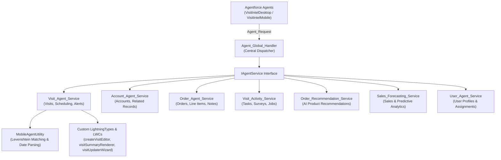

# Consumer Goods Cloud Visit Intelligence Agentforce Skill

This skill provides architectural guidance, domain service reference maps, UI rendering schemas, fuzzy matching algorithms, and testing standards for developing, maintaining, and deploying Agentforce agents (`VisitIntelDesktop` and `VisitIntelMobile`) in Salesforce Consumer Goods (CG) Cloud.

---

## 1. High-Level System Architecture

The CG Cloud Visit Intelligence architecture follows a modular **Domain Service Pattern** decoupled by a central dispatching router:



---

## 2. Core Domain Services Reference

| Domain Service | Class Name | Test Class | Key Capabilities |
| :--- | :--- | :--- | :--- |
| **Global Router** | `Agent_Global_Handler` | `Agent_Global_HandlerTest` | Receives `Agent_Request`, inspects `domain` / `actionType`, and delegates to domain service instances. |
| **Visit Intelligence** | `Visit_Agent_Service` | `Visit_Agent_ServiceTest` | Available visits, account visits, out-of-stock (OOS) visits, store briefs, summaries, status/notes updates, visit creation. |
| **Account Intelligence** | `Account_Agent_Service` | `Account_Agent_ServiceTest` | Account summaries, related record counts (contacts, opps, cases, visits, promos, assortments), product eligibility. |
| **Order Intelligence** | `Order_Agent_Service` | `Order_Agent_ServiceTest` | Historical order lookup, order line items, spend insights, delivery note & invoice note DML updates. |
| **Visit Activity** | `Visit_Activity_Service` | `Visit_Activity_ServiceTest` | Planned activities, execution jobs, survey question responses, pending task status checks. |
| **Order Recommendation** | `Order_Recommendation_Service` | `Order_Recommendation_ServiceTest` | AI recommendation logic, sellable product catalog matching, ordering frequency analysis. |
| **Sales Forecasting** | `Sales_Forecasting_Service` | `Sales_Forecasting_ServiceTest` | Sales trend forecasting, customer spend predictions, inventory balance projections, visit outcome forecasts. |
| **User Management** | `User_Agent_Service` | `User_Agent_ServiceTest` | Resolves user profile names, owner assignments, rep lookup fuzzy matching. |
| **Fuzzy & Date Utility** | `MobileAgentUtility` | `MobileAgentUtilityTest` | Levenshtein distance record matching (0-100 score), natural language datetime parser ("tomorrow at 10am", "next Monday"). |

---

## 3. Custom UI Rendering & Lightning Types

Custom DTO Apex wrappers are mapped to Custom Lightning Types to render rich interactive cards in the Agentforce chat window across **Desktop (Lightning Desktop GenAi)**, **Mobile (Lightning Mobile GenAi)**, and **Enhanced Web Chat**:

| Apex DTO Wrapper | Lightning Type | LWC Renderer / Editor | Function |
| :--- | :--- | :--- | :--- |
| `CreateVisitWrapper` | `createVisitWrapperType` | `createVisitEditor` | Interactive modal in chat window for creating new visits. |
| `VisitSummaryWrapper` | `visitSummaryWrapperType` | `visitSummaryRenderer` | Formatted card displaying store brief, task progress, OOS issues, spend, and 1-click suggestion buttons. |
| `VisitUpdatePayload` | `visitUpdatePayloadType` | `visitUpdaterWizard` | Interactive step wizard allowing reps to update visit status and add representative notes. |

---

## 4. Key Implementation Rules & Gotchas

1. **`Schema.Location` vs `System.Location`:**
   In CG Cloud Apex, standard SObject `Location` references must always be explicitly typed as `Schema.Location` to prevent namespace collisions with built-in system class `System.Location`.
2. **`PlaceId` Constraint on Visit Records:**
   All `Visit` object inserts require a valid `PlaceId` lookup pointing to a valid `Schema.Location` record. Unit tests must programmatically insert a `Schema.Location` record and map its ID.
3. **Read-Only Mocking via JSON Deserialization:**
   Read-only database fields (such as `cgcloud__Inventory__c.cgcloud__Balance__c`) must be set in unit tests using `JSON.deserialize`.
4. **Direct Google Maps Links:**
   Google Maps navigation links for Account summaries across `VisitIntelDesktop` and `VisitIntelMobile` MUST be generated directly as web URLs (`https://www.google.com/maps?q=...`) matching protocol behavior like `mailto:` and `tel:`.

---

## 5. Salesforce CLI Deployment Commands

After modifying or updating the Visit Intelligence agent, always provide the exact CLI commands:

```bash
# 1. Validate Agent Authoring Bundle
sf agent validate authoring-bundle --json --api-name VisitIntelDesktop
sf agent validate authoring-bundle --json --api-name VisitIntelMobile

# 2. Deploy Agent Metadata
sf project deploy start --json --metadata AiAuthoringBundle:VisitIntelDesktop
sf project deploy start --json --metadata AiAuthoringBundle:VisitIntelMobile

# 3. Publish Agent Authoring Bundle
sf agent publish authoring-bundle --json --api-name VisitIntelDesktop
sf agent publish authoring-bundle --json --api-name VisitIntelMobile

# 4. Activate Agent
sf agent activate --json --api-name VisitIntelDesktop
sf agent activate --json --api-name VisitIntelMobile
```
