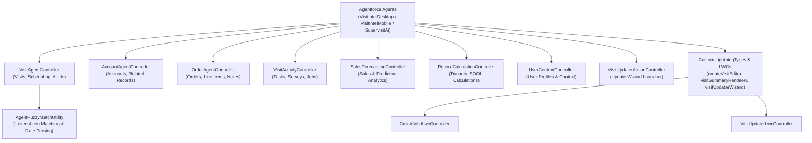

# Consumer Goods Cloud Visit Intelligence Agentforce Skill

This skill provides architectural guidance, domain controller reference maps, UI rendering schemas, fuzzy matching algorithms, and testing standards for developing, maintaining, and deploying Agentforce agents (`VisitIntelDesktop` and `VisitIntelMobile`) in Salesforce Consumer Goods (CG) Cloud.

---

## 1. High-Level System Architecture

The CG Cloud Visit Intelligence architecture follows a modular **Domain Controller Pattern**:

---

## 2. Core Domain Controllers Reference

| Domain Controller | Class Name | Test Class | Key Capabilities |
| :--- | :--- | :--- | :--- |
| **Visit Intelligence** | `VisitAgentController` | `VisitAgentControllerTest` | Available visits, account visits, OOS visits, store briefs, summaries, status/notes updates, visit creation. |
| **Account Intelligence** | `AccountAgentController` | `AccountAgentControllerTest` | Account summaries, related record counts (contacts, opps, cases, visits, promos, assortments), product eligibility. |
| **Order Intelligence** | `OrderAgentController` | `OrderAgentControllerTest` | Historical order lookup, order line items, spend insights, delivery note & invoice note updates. |
| **Visit Activity** | `VisitActivityController` | `VisitActivityControllerTest` | Planned activities, execution jobs, survey question responses, pending task status checks. |
| **Sales Forecasting** | `SalesForecastingController` | `SalesForecastingControllerTest` | Sales trend forecasting, customer spend predictions, inventory balance projections. |
| **Calculations** | `RecordCalculationController` | `RecordCalculationControllerTest` | Dynamic SOQL calculation execution in User Mode. |
| **User Profile** | `UserContextController` | `UserContextControllerTest` | Resolves user profile names and logged-in user context. |
| **Visit Updater Action** | `VisitUpdaterActionController` | `VisitUpdaterLwcControllerTest` | Launches and executes updates from the Visit Updater Wizard. |
| **Create Visit LWC** | `CreateVisitLwcController` | `CreateVisitLwcControllerTest` | `@AuraEnabled` lookups for `createVisitEditor` LWC. |
| **Visit Updater LWC** | `VisitUpdaterLwcController` | `VisitUpdaterLwcControllerTest` | `@AuraEnabled` lookups and saves for `visitUpdaterWizard` LWC. |
| **Fuzzy & Date Utility** | `AgentFuzzyMatchUtility` | `AgentFuzzyMatchUtilityTest` | Levenshtein distance record matching (0-100 score), natural language datetime parser. |
| **Test Data Generator** | `AgentTestData` | `AgentTestDataTest` | Seeder for sample test and demo data. |

---

## 3. Custom UI Rendering & Lightning Types

Custom DTO Apex wrappers are mapped to Custom Lightning Types to render rich interactive cards in the Agentforce chat window:

| Apex DTO Wrapper | Lightning Type | LWC Renderer / Editor | Function |
| :--- | :--- | :--- | :--- |
| `CreateVisitWrapper` | `createVisitWrapperType` | `createVisitEditor` | Interactive form to edit and create new visits directly in chat. |
| `VisitSummaryWrapper` | `visitSummaryWrapperType` | `visitSummaryRenderer` | Summary card displaying completed visit KPIs, store details, and next steps. |
| `VisitUpdatePayload` | `visitUpdatePayloadType` | `visitUpdaterWizard` | Interactive step wizard to reschedule visits, update status, and notes. |
