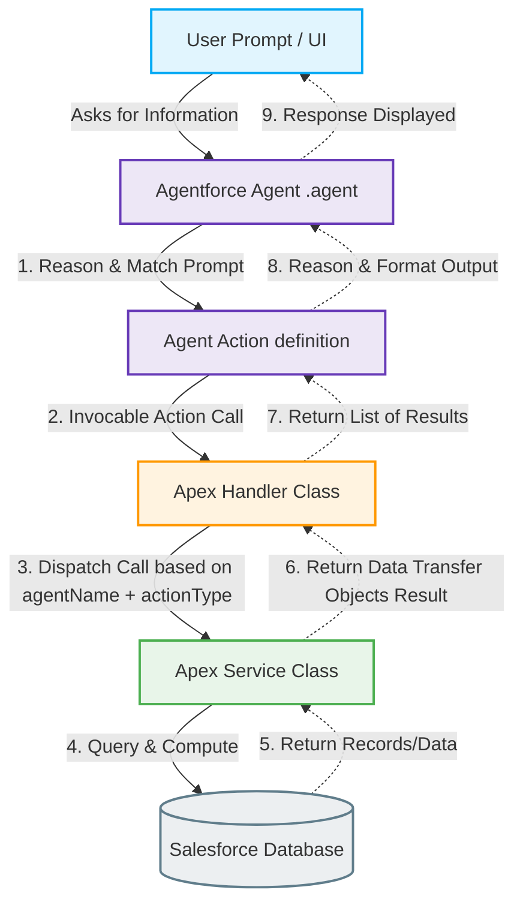

# Agentforce Agent to Apex Service Logic Flow Architecture

This document explains the end-to-end architecture and control flow of the `CGC_Intelligence` and `Visit_Intelligence` Agentforce agents, detailing how logic flows from user prompts in the agent UI, through Apex Handler classes, down to the Apex Service implementation classes.

---

## 1. High-Level Architecture Overview

The backend logic is decoupled using a dispatcher-service pattern. Because Salesforce Agentforce action invocation relies on invocable methods, and Apex classes are restricted to **one** `@InvocableMethod` declaration per class, we use a single entry point class per functional area (e.g., Accounts, Orders, Visits, Users) called a **Handler**.

The Handler inspects parameters passed by the Agent (`agentName` and `actionType`) to dispatch execution to the correct **Service** class where the actual database queries and business logic reside.

### Architectural Flow Diagram



---

## 2. End-to-End Control Flow Breakdown

### Step 1: User Prompt & Agent Reasoning
When a user asks a question in the Agentforce chat (e.g. *"Show me today's scheduled visits"*):
1. The **Agent** (`Visit_Intelligence.agent` or `CGC_Intelligence.agent`) processes the prompt using its LLM reasoning model.
2. It matches the user's intent to one of the configured actions based on descriptions defined in the agent bundle. For example, it matches *"today's visits"* to the `find_visits` action.
3. It extracts variables (like `searchQuery = "today"`) and binds context parameters:
   - `agentName` (bound statically in the agent file, e.g. `"Visit_Intelligence"`)
   - `actionType` (bound statically, e.g. `"search"`)
   - Inputs (extracted dynamically from the conversation, e.g. `searchQuery`)

*Example Snippet from `Visit_Intelligence.agent`:*
```yaml
            find_visits: @actions.search_visits
                description: "Search for Visit records..."
                with agentName = "Visit_Intelligence"
                with actionType = "search"
                with searchQuery = ...
```

---

### Step 2: Invocable Action Call (Agent to Handler)
Agentforce calls the Apex action bound to the matched target. The target points directly to the `@InvocableMethod` of the corresponding **Handler** class:

```yaml
        search_visits:
            description: "Search for Visit records..."
            target: "apex://Visit_Agent_Handler"
            inputs:
                agentName: string
                actionType: string
                searchQuery: string
            outputs:
                visits: list[object]
                    complex_data_type_name: "@apexClassType/c__Visit_Agent_Handler$VisitOption"
```

The Salesforce platform serializes the inputs and invokes `Visit_Agent_Handler.execute(List<Request> requests)`.

---

### Step 3: Dispatch & Execution (Handler to Service)
The **Handler** acts as a lightweight router/dispatcher. It:
1. Iterates through the list of incoming requests.
2. Inspects `req.agentName` (e.g. `CGC_Intelligence` or `Visit_Intelligence`) and `req.actionType` (e.g. `getavailable`, `search`, `getstorebrief`).
3. Calls the appropriate static method on the dedicated **Service** class.

*Example Code from `Visit_Agent_Handler.cls`:*
```apex
public with sharing class Visit_Agent_Handler {
    ...
    @InvocableMethod(label='Visit Agent Handler' description='Handles all Visit operations for Agents')
    public static List<Result> execute(List<Request> requests) {
        List<Result> results = new List<Result>();
        for (Request req : requests) {
            Result res = new Result();
            String agent = req.agentName != null ? req.agentName.trim() : '';
            String action = req.actionType != null ? req.actionType.toLowerCase().trim() : '';

            if (agent.equalsIgnoreCase('CGC_Intelligence')) {
                if (action == 'getavailable') {
                    res.visits = CGC_Intelligence_Service2.getAvailableVisits();
                } else if (action == 'search') {
                    res.visits = CGC_Intelligence_Service2.searchVisits(req.searchQuery);
                }
                ...
            } else if (agent.equalsIgnoreCase('Visit_Intelligence')) {
                if (action == 'getavailable') {
                    res.visits = Visit_Intelligence_Service2.getAvailableVisits();
                } else if (action == 'search') {
                    res.visits = Visit_Intelligence_Service2.searchVisits(req.searchQuery);
                }
                ...
            }
            results.add(res);
        }
        return results;
    }
}
```

---

### Step 4: Logic Implementation (Service Class)
The **Service** class implements the heavy lifting—validating parameters, writing SOQL/SOSL queries, performing calculations, formatting data, and constructing wrapper DTO objects (like `RecordInfo` or `VisitOption`).

*Example Code from `Visit_Intelligence_Service2.cls`:*
```apex
public with sharing class Visit_Intelligence_Service2 {
    public static List<Visit_Agent_Handler.VisitOption> searchVisits(String searchQuery) {
        List<Visit_Agent_Handler.VisitOption> options = new List<Visit_Agent_Handler.VisitOption>();
        if (String.isBlank(searchQuery)) {
            return options;
        }
        try {
            String pattern = '%' + searchQuery.trim().replaceAll('\\s+', '%') + '%';
            List<Visit> visits = [
                SELECT Id, Status, Account.Name, PlannedVisitStartTime 
                FROM Visit 
                WHERE Account.Name LIKE :pattern OR Status LIKE :pattern 
                WITH USER_MODE 
                LIMIT 15
            ];
            for (Visit v : visits) {
                String dateStr = v.PlannedVisitStartTime != null ? v.PlannedVisitStartTime.format('yyyy-MM-dd') : 'No Date';
                String lbl = 'Visit on ' + dateStr + ' for ' + v.Account.Name + ' (Status: ' + v.Status + ')';
                options.add(new Visit_Agent_Handler.VisitOption(v.Id, v.Account.Name, lbl, 'Search Result'));
            }
        } catch (Exception e) {}
        return options;
    }
}
```

---

### Step 5: Returning Output back to the Agent
1. The **Service** method returns the result (e.g., `List<VisitOption>`) to the **Handler**.
2. The **Handler** assigns the results to the output list and returns it to the Agentforce runtime.
3. The **Agent** receives the structured output payload.
4. Using its reasoning guidelines and formatting instructions, the agent renders the response (e.g., presenting a formatted markdown list or table) to the user.

---

## 3. Key Mapping Tables

Here is the quick mapping showing which **Agent Action** goes to which **Handler**, and where it is dispatched in the **Service** layer:

| Agent Action | Target Handler Class | Dispatched Service Class | Action Type Parameter |
| :--- | :--- | :--- | :--- |
| `get_related_counts` | `Account_Agent_Handler` | `CGC_Intelligence_Service` <br> `Visit_Intelligence_Service` | `getCounts` |
| `get_related_records` | `Account_Agent_Handler` | `CGC_Intelligence_Service` <br> `Visit_Intelligence_Service` | `getRecords` |
| `suggest_products` | `Account_Agent_Handler` | `CGC_Intelligence_Service` <br> `Visit_Intelligence_Service` | `suggestProducts` |
| `get_order_summary` | `Order_Agent_Handler` | `CGC_Intelligence_Service` <br> `Visit_Intelligence_Service` | `getAccountSummary` |
| `get_visit_orders` | `Order_Agent_Handler` | `CGC_Intelligence_Service` <br> `Visit_Intelligence_Service` | `getVisitSummary` |
| `get_order_items` | `Order_Agent_Handler` | `CGC_Intelligence_Service` <br> `Visit_Intelligence_Service` | `getLineItems` |
| `update_order_notes` | `Order_Agent_Handler` | `CGC_Intelligence_Service` <br> `Visit_Intelligence_Service` | `updateNotes` |
| `get_available_visits` | `Visit_Agent_Handler` | `CGC_Intelligence_Service2` <br> `Visit_Intelligence_Service2` | `getAvailable` |
| `search_visits` | `Visit_Agent_Handler` | `CGC_Intelligence_Service2` <br> `Visit_Intelligence_Service2` | `search` |
| `get_store_brief` | `Visit_Agent_Handler` | `CGC_Intelligence_Service2` <br> `Visit_Intelligence_Service2` | `getStoreBrief` |
| `generate_visit_summary`| `Visit_Agent_Handler` | `CGC_Intelligence_Service2` <br> `Visit_Intelligence_Service2` | `generateSummary` |
| `update_visit` | `Visit_Agent_Handler` | `CGC_Intelligence_Service2` <br> `Visit_Intelligence_Service2` | `updateVisit` |
| `search_users` | `User_Agent_Handler` | `CGC_Intelligence_Service2` <br> `Visit_Intelligence_Service2` | `search` |
