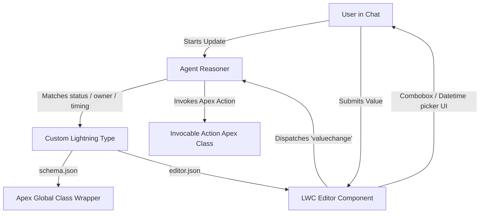

# Architectural Documentation: Agentforce Custom Inputs Implementation

## 1. Executive Summary
To improve the user experience of the `VisitIntelligence` agent, this feature replaces default text-based inputs with custom Lightning Web Components (LWCs) for slot-filling fields:
1. **Visit Status** (Pick-list)
2. **Visit Owner / Assigned Rep** (Dynamic User lookup picklist)
3. **Visit End Date & Time** (Date/Time picker)

This document describes the end-to-end architecture, metadata bindings, and design guidelines established during this implementation.

---

## 2. System Architecture & Component Mapping

The custom UI binding architecture runs across multiple layers of the Salesforce platform:
1. **Agent Reasoner**: Maps parameters to custom Lightning Types in `VisitIntelligence.agent`.
2. **Lightning Type Layer**: Custom types that map the logical schema to Apex variables and binds the component override.
3. **Apex Layer**: Strong-typed global data wrappers.
4. **LWC Presentation Layer**: Custom rendering components.

---

## 3. Component Details & Folder Path References

Below is the directory structure and reference path for each component implemented:

### A. Apex Wrappers
To allow Agentforce to serialize and deserialize the complex objects, each data type maps to a dedicated global wrapper class:
* **Status**: [VisitStatusWrapper.cls](file:///c:/Users/Bhanu%20Bobba/Documents/CGCCloud/CGCORG/force-app/main/default/classes/VisitStatusWrapper.cls)
* **Owner**: [VisitOwnerWrapper.cls](file:///c:/Users/Bhanu%20Bobba/Documents/CGCCloud/CGCORG/force-app/main/default/classes/VisitOwnerWrapper.cls)
* **Date & Time**: [VisitDateTimeWrapper.cls](file:///c:/Users/Bhanu%20Bobba/Documents/CGCCloud/CGCORG/force-app/main/default/classes/VisitDateTimeWrapper.cls)

### B. Custom Lightning Types
Registered under the `force-app/main/default/lightningTypes/` directory:
1. **visitStatusWrapperType**:
   * Schema: [schema.json](file:///c:/Users/Bhanu%20Bobba/Documents/CGCCloud/CGCORG/force-app/main/default/lightningTypes/visitStatusWrapperType/schema.json) (Maps to `c__VisitStatusWrapper`)
   * Editor Bindings: [editor.json](file:///c:/Users/Bhanu%20Bobba/Documents/CGCCloud/CGCORG/force-app/main/default/lightningTypes/visitStatusWrapperType/lightningDesktopGenAi/editor.json) (Points to `c/visitStatusEditor`)
2. **visitOwnerWrapperType**:
   * Schema: [schema.json](file:///c:/Users/Bhanu%20Bobba/Documents/CGCCloud/CGCORG/force-app/main/default/lightningTypes/visitOwnerWrapperType/schema.json) (Maps to `c__VisitOwnerWrapper`)
   * Editor Bindings: [editor.json](file:///c:/Users/Bhanu%20Bobba/Documents/CGCCloud/CGCORG/force-app/main/default/lightningTypes/visitOwnerWrapperType/lightningDesktopGenAi/editor.json) (Points to `c/visitOwnerEditor`)
3. **visitDateTimeWrapperType**:
   * Schema: [schema.json](file:///c:/Users/Bhanu%20Bobba/Documents/CGCCloud/CGCORG/force-app/main/default/lightningTypes/visitDateTimeWrapperType/schema.json) (Maps to `c__VisitDateTimeWrapper`)
   * Editor Bindings: [editor.json](file:///c:/Users/Bhanu%20Bobba/Documents/CGCCloud/CGCORG/force-app/main/default/lightningTypes/visitDateTimeWrapperType/lightningDesktopGenAi/editor.json) (Points to `c/visitDateTimeEditor`)

### C. Lightning Web Components
Created to provide custom, mobile-friendly forms in the chat feed:
* **visitStatusEditor**: [visitStatusEditor](file:///c:/Users/Bhanu%20Bobba/Documents/CGCCloud/CGCORG/force-app/main/default/lwc/visitStatusEditor) (Combobox selection mapping to `InProgress`, `Completed`, `Canceled`, `Abandoned`, `Planned`).
* **visitOwnerEditor**: [visitOwnerEditor](file:///c:/Users/Bhanu%20Bobba/Documents/CGCCloud/CGCORG/force-app/main/default/lwc/visitOwnerEditor) (Dynamic user selection pulling active reps via an Apex wire call).
* **visitDateTimeEditor**: [visitDateTimeEditor](file:///c:/Users/Bhanu%20Bobba/Documents/CGCCloud/CGCORG/force-app/main/default/lwc/visitDateTimeEditor) (Calendar date-time input form).

### D. Invocable Action Apex Classes
Apex actions executing the update logic receive the complex parameter wrapper and extract the value to update the Visit:
* [Update_Visit_Status_Action.cls](file:///c:/Users/Bhanu%20Bobba/Documents/CGCCloud/CGCORG/force-app/main/default/classes/Update_Visit_Status_Action.cls)
* [Update_Visit_Owner_Action.cls](file:///c:/Users/Bhanu%20Bobba/Documents/CGCCloud/CGCORG/force-app/main/default/classes/Update_Visit_Owner_Action.cls)
* [Update_Visit_StartTime_Action.cls](file:///c:/Users/Bhanu%20Bobba/Documents/CGCCloud/CGCORG/force-app/main/default/classes/Update_Visit_StartTime_Action.cls)
* [Update_Visit_EndTime_Action.cls](file:///c:/Users/Bhanu%20Bobba/Documents/CGCCloud/CGCORG/force-app/main/default/classes/Update_Visit_EndTime_Action.cls)

---

## 4. Key Design Decisions

### 1. Separate Outer Wrapper Classes
* **Problem**: Attempting to use inner classes (e.g. `Update_Visit_Status_Action$VisitStatusWrapper`) for the `@InvocableVariable` complex type parameter compiles but fails serialization checks at runtime, causing the agent to fall back to a text box.
* **Resolution**: Created dedicated global Apex classes in separate files with no-argument constructors, ensuring clean compilation and runtime binding.

### 2. Wrapper Custom Lightning Types
* **Problem**: Once a Lightning Type is deployed in an org, modifying its target `lightning:type` (for example, pointing it to our new outer wrappers) triggers a validation error from the Salesforce Metadata API: *"Schema update contains breaking changes"*.
* **Resolution**: Created brand new Custom Lightning Types (appending `WrapperType` to the folders and names) to deploy clean metadata definitions without conflict.

### 3. Editor Bindings via Metadata
* **Problem**: Invocable actions only know about the data schema contract, not which UI component overrides the default text box.
* **Resolution**: Configured `editor.json` in the `lightningDesktopGenAi` subfolder within each type directory. This explicitly maps the custom type to its respective LWC, eliminating the need to set up overrides manually in Salesforce Setup.
