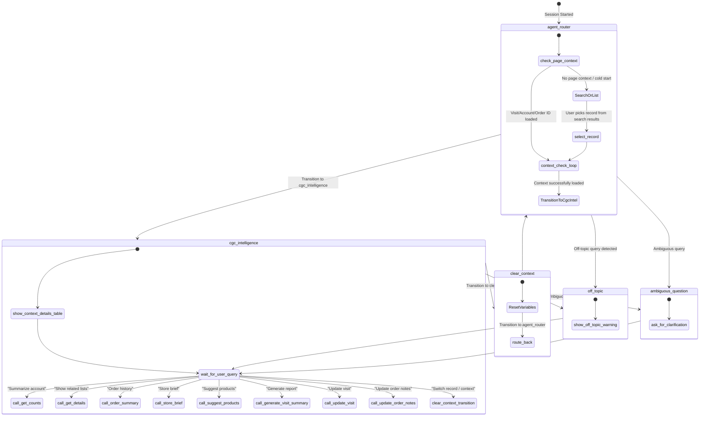

# CGC Intelligence Agent Analysis & Syntax Guide 

This document provides a comprehensive analysis of the CGC Intelligence Agent, explaining Agent Script syntax, the purpose of each block in `CGC_Intelligence.agent`, subagent behaviors, and the design and logic of all underlying Apex classes and Flow backing actions.

## 1. Agent Script Syntax & Execution Model Guide

Agent Script is Salesforce's scripting language for authoring next-generation AI agents running on the Atlas Reasoning Engine. It uses a YAML-like structure with specific grammar rules and flow control.

**Block Structure & Ordering**
An Agent Script file is compiled sequentially and must strictly adhere to the following block ordering:
- `system:` — Global system instructions, welcome message, and fallback error messages.
- `config:` — Configuration variables like the agent name, label, description, and execution context.
- `model_config:` (Optional) — Selects the backing LLM model.
- `variables:` — Shared, mutable data storage variables scoped to the session.
- `language:` — Configures locale settings.
- `start_agent:` — Defines the entry point subagent (router) that handles initial requests.
- `subagent:` — Modules specialized for handling specific conversational domains.
- `actions:` — Local action declarations (Apex, Flow, etc.) defined either within a subagent or globally.

**Basic Syntax Rules**
- **Indentation:** Exactly 4 spaces per indent level. Do NOT use tabs.
- **Strings:** All string literals must be double-quoted. Multiline strings use `|` or `->`.
- **Booleans:** Must be capitalized: `True` or `False`.
- **Variables:** Reference using `@variables.variableName`.
- **Subagents:** Reference using `@subagent.subagentName`.
- **Actions:** Reference using `@actions.actionName`.
- **Ephemeral Bindings:** In reasoning blocks, `@outputs.paramName` lives immediately within the transition or set statement following that action.

## 2. Block-by-Block Explanation of `CGC_Intelligence.agent`

### 2.1. system: Block
Defines the agent's identity, behavior instructions, and default system strings. Instructs the agent to assist internal users with analysis of Account, Order, and Visit records, maintaining a professional, helpful, and concise tone.

### 2.2. config: Block
- `developer_name`: `CGC_Intelligence`
- `agent_type`: `AgentforceEmployeeAgent` (Operates on behalf of an internal Salesforce employee).

### 2.3. model_config: Block
Instructs the Atlas Engine to use `sfdc_ai__DefaultBedrockAnthropicClaude45Sonnet`.

### 2.4. variables: Block
Stores persistent execution context.
- `currentRecordId`, `currentObjectApiName`: Visibility "External" to automatically absorb the Lightning record page context.
- Other internal session variables maintain the active Account, Visit, and Order (e.g., `accountId`, `visitId`, `orderId`).

## 3. Subagents & Conversation Flow

### 3.1. start_agent agent_router
The entry point. It evaluates initial page context or guides the user to locate a record.
- **Before Reasoning:** Automatically sets `visitId`, `accountId`, or `orderId` if launched from the corresponding record page.
- **Reasoning instructions & actions:**
  - Calls details actions (`get_visit_details`, `get_account_details`, `get_order_details`) to retrieve names and statuses when context is set.
  - Transitions to `cgc_intelligence` subagent if an Account is loaded.
  - Allows searching for Accounts, Visits, or Orders using `find_accounts`, `find_visits`, `find_orders`, or listing recent visits with `list_visits`.
  - Prompts the user to pick from a numbered list before selecting the context via `select_account`, `select_visit`, or `select_order`.

### 3.2. subagent cgc_intelligence
The main functional module. Once context is locked, this subagent handles deep inquiries.
- **Key Instructions:**
  - Formats responses with clear emojis, bold headings, tables, and lists.
  - Shows an introductory table of the active Account/Visit/Order when context is loaded.
  - Calls `get_counts` for high-level summaries.
  - Calls `get_details` for lists of records (e.g., contacts, tactics, out-of-stock).
  - Calls `order_summary` to analyze purchasing patterns.
  - Calls `get_visit_orders` for orders tied to the current Visit.
  - Calls `order_items` for line items of an order.
  - Calls `store_brief` to get a consolidated audit/overview.
  - Calls `suggest_products` for product recommendations.
  - Calls `generate_visit_summary` to summarize execution metrics.
  - Calls `update_visit` and `search_users` to handle visit modifications.
  - `switch_context` returns the user to the router to switch records.

### 3.3. subagent off_topic
Explicitly instructs the agent to decline general knowledge queries and refocus on Salesforce CGC Intelligence (Accounts, Visits, Orders).

### 3.4. subagent ambiguous_question
Clarification layer if the user request is ambiguous.

### 3.5. subagent clear_context
Utility subagent that resets all context variables (Visit, Account, Order) before routing back to the `agent_router`.

## 4. Backing Actions (Flows & Apex Classes)

### 4.1. Get_Visit_Details.flow-meta.xml (Flow)
**Target:** `flow://Get_Visit_Details`
**Purpose:** Fetches basic data from the Visit record and its linked Account.

### 4.2. GetAccountDetails_CGC_Intelligence.cls (Apex Class)
**Target:** `apex://GetAccountDetails_CGC_Intelligence`
**Purpose:** Retrieve Account Name from Account ID.
**Internal Logic:** Executes a simple SOQL lookup `SELECT Id, Name FROM Account WHERE Id = :accountId` using USER_MODE.

### 4.3. GetOrderDetails_CGC_Intelligence.cls (Apex Class)
**Target:** `apex://GetOrderDetails_CGC_Intelligence`
**Purpose:** Retrieve Order details and its parent Account.
**Internal Logic:** Queries `cgcloud__Order__c` and fetches the phase and the parent `cgcloud__Order_Account__r.Name`.

### 4.4. SearchAccounts_CGC_Intelligence.cls (Apex Class)
**Target:** `apex://SearchAccounts_CGC_Intelligence`
**Purpose:** Search for Account records by name.
**Inputs:** `searchQuery` (String)
**Outputs:** `accounts` (List of AccountOption)
**Internal Logic:** Uses a wildcard pattern to search `Name LIKE :pattern` and formats the results with Name and BillingCity.

### 4.5. SearchOrders_CGC_Intelligence.cls (Apex Class)
**Target:** `apex://SearchOrders_CGC_Intelligence`
**Purpose:** Search for Order records by name or account name.
**Inputs:** `searchQuery` (String)
**Outputs:** `orders` (List of OrderOption)
**Internal Logic:** Searches against both `Name` and `cgcloud__Order_Account__r.Name` fields and formats a clean label showing Order status and Account.

### 4.6. GetAvailableVisits.cls & SearchVisitsForAgent.cls (Apex Classes)
**Purpose:** Retrieve scheduled, recent, or searched visits. Returns custom `VisitOption` wrappers with detailed labels.

### 4.7. GetAccountRelatedCounts.cls (Apex Class)
**Target:** `apex://GetAccountRelatedCounts`
**Purpose:** Fetches aggregate counts of related objects (Contacts, Visits, Tasks, Promotions, etc.) using individual COUNT() queries.

### 4.8. GetAccountRelatedRecords.cls (Apex Class)
**Target:** `apex://GetAccountRelatedRecords`
**Purpose:** Retrieves a detailed list of related records based on a specified category type (e.g. 'contacts', 'visits', 'promotions').

### 4.9. GetAccountOrderSummaryForAgent.cls & GetVisitOrderSummary.cls (Apex Classes)
**Purpose:** Summarizes purchasing history and aggregates sales metrics (spending, frequent purchases, phase breakdowns) for an Account or a Visit.

### 4.10. GetOrderLineItems.cls (Apex Class)
**Purpose:** Fetches the exact product items inside a given order.

### 4.11. UpdateOrderNotes.cls (Apex Class)
**Target:** `apex://UpdateOrderNotes`
**Purpose:** Update delivery notes and/or invoice notes on a specific CG Cloud Order. Requires User Confirmation.

### 4.12. GetStoreBrief.cls (Apex Class)
**Target:** `apex://GetStoreBrief`
**Purpose:** Generate a consolidated markdown store brief incorporating recent order totals, active promotions, pending tasks, and recent OOS issues.

### 4.13. SuggestProductsForStore.cls (Apex Class)
**Target:** `apex://SuggestProductsForStore`
**Purpose:** Get ranked product recommendations based on catalog gaps, order frequency, and active promotions.

### 4.14. GenerateVisitSummary.cls (Apex Class)
**Target:** `apex://GenerateVisitSummary`
**Purpose:** Collect visit execution metrics, format as markdown, and write them to the Visit's Note field.

### 4.15. UpdateVisitDetails.cls & SearchUsersForAgent.cls (Apex Classes)
**Purpose:** Manage assignment, status, and note updates for the active Visit record.

## 5. Conversational Architecture Diagram
Below is the state transition diagram representing how the CGC Intelligence agent manages its cross-context capabilities.

