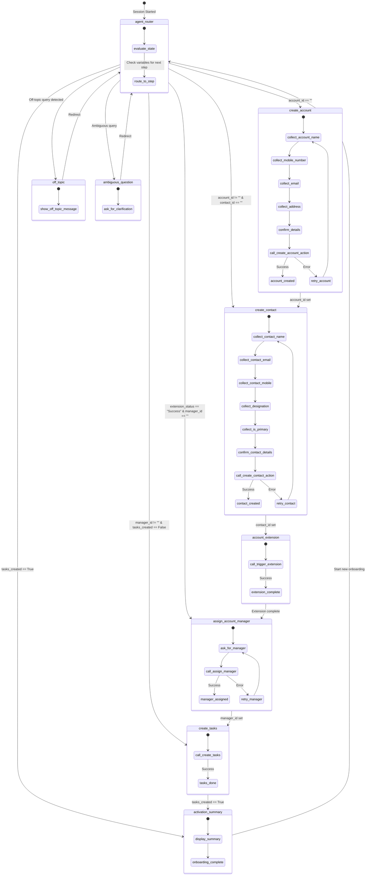

# Customer Account Onboarding Agent Analysis & Syntax Guide 

This document provides a comprehensive analysis of the Customer Account Onboarding Agent, explaining Agent Script syntax, the purpose of each block in `Customer_Account_Onboarding_Agent.agent`, subagent behaviors, and the design and logic of all underlying Apex classes backing actions.

## 1. Agent Script Syntax & Execution Model Guide

Agent Script is Salesforce's scripting language for authoring next-generation AI agents running on the Atlas Reasoning Engine. It uses a YAML-like structure with specific grammar rules and flow control.

**Block Structure & Ordering**
An Agent Script file is compiled sequentially and must strictly adhere to the following block ordering:
- `system:` — Global system instructions, welcome message, and fallback error messages.
- `config:` — Configuration variables like the agent name, label, description, and execution context.
- `model_config:` (Optional) — Selects the backing LLM model.
- `variables:` — Shared, mutable data storage variables scoped to the session.
- `language:` — Configures locale settings.
- `start_agent:` — Defines the entry point subagent (router) that handles initial requests.
- `subagent:` — Modules specialized for handling specific conversational domains.
- `actions:` — Local action declarations (Apex, Flow, etc.) defined either within a subagent or globally.

**Basic Syntax Rules**
- **Indentation:** Exactly 4 spaces per indent level. Do NOT use tabs.
- **Strings:** All string literals must be double-quoted. Multiline strings use `|` or `->`.
- **Booleans:** Must be capitalized: `True` or `False`.
- **Variables:** Reference using `@variables.variableName`.
- **Subagents:** Reference using `@subagent.subagentName`.
- **Actions:** Reference using `@actions.actionName`.
- **Ephemeral Bindings:** In reasoning blocks, `@outputs.paramName` lives immediately within the transition or set statement following that action.

## 2. Block-by-Block Explanation of `Customer_Account_Onboarding_Agent.agent`

### 2.1. system: Block
Defines the agent's identity and behavior instructions. Instructs the agent to act as an intelligent Customer Account Onboarding Assistant that collects, validates, and processes all required customer information to activate a new account quickly and accurately. The agent is instructed to ask one question at a time and maintain a professional tone.

### 2.2. config: Block
- `developer_name`: `Customer_Account_Onboarding_Agent`
- `agent_label`: `Customer Account Onboarding Agent`
- `agent_type`: `AgentforceEmployeeAgent` (Operates on behalf of an internal Salesforce employee).

### 2.3. variables: Block
Stores persistent execution context across the onboarding session.
- `account_id` (string): Holds the created Account record's ID.
- `contact_id` (string): Holds the created Contact record's ID.
- `account_extension_status` (string): Tracks whether the Account Extension process completed successfully.
- `account_manager_id` (string): Holds the assigned Account Manager's User ID.
- `tasks_created` (boolean): Flag indicating whether onboarding tasks have been generated.

## 3. Subagents & Conversation Flow

### 3.1. start_agent agent_router
The entry point and orchestrator. It evaluates the current onboarding state and routes the user to the next appropriate step based on which variables have been populated.
- **Routing Logic (availability guards):**
  - `go_to_account` → Transitions to `create_account` when `account_id` is empty (no account created yet).
  - `go_to_contact` → Transitions to `create_contact` when an account exists but `contact_id` is empty.
  - `go_to_manager` → Transitions to `assign_account_manager` when the account extension succeeded but no manager is assigned.
  - `go_to_tasks` → Transitions to `create_tasks` when a manager is assigned but tasks have not been created.
  - `go_to_summary` → Transitions to `activation_summary` when all tasks are created.
  - `go_to_off_topic` → Transitions to `off_topic` for non-onboarding queries.
  - `go_to_ambiguous_question` → Transitions to `ambiguous_question` for unclear requests.
- **Design Pattern:** Uses `available when` guards on each transition to create a linear, state-driven onboarding pipeline.

### 3.2. subagent create_account
Collects account details step-by-step and creates an Account record.
- **Collected Fields (one at a time):**
  1. 📂 **Account Name**
  2. 📞 **Mobile Number** (format validated)
  3. 📧 **Email Address** (pattern validated: `.+@.+\..+`)
  4. 🏢 **Complete Address** — parsed into Street, City, State, Postal Code, and Country
- **Key Instructions:**
  - Fields are mandatory; the agent does not proceed until all are provided.
  - Displays collected information for user confirmation before submission.
  - On failure, shows the error message and allows the user to correct data.
  - On success, sets `@variables.account_id` and transitions to `create_contact`.
- **Backing Action:** `create_account_action` → `apex://CreateAccountAction`
- **after_reasoning:** Automatically transitions to `create_contact` once `account_id` is populated.

### 3.3. subagent create_contact
Collects contact information and creates a Contact linked to the previously created Account.
- **Collected Fields (one at a time):**
  1. Contact Name
  2. Contact Email Address (format validated)
  3. Contact Mobile Number (format validated)
  4. Designation / Role
  5. Primary Point of Contact (Yes/No)
- **Key Instructions:**
  - Confirms data before calling the action.
  - On failure, shows error and allows retry.
  - On success, sets `@variables.contact_id` and transitions to `account_extension`.
- **Backing Action:** `create_contact_action` → `apex://CreateContactAction`
- **after_reasoning:** Automatically transitions to `account_extension` once `contact_id` is populated.

### 3.4. subagent account_extension
A system-level (non-interactive) subagent that triggers backend account extension logic.
- **Behavior:** Immediately calls `trigger_account_extension_action` with the `account_id`, sets `account_extension_status` to `"Success"`, and transitions to `assign_account_manager`.
- **Backing Action:** `trigger_account_extension_action` → `apex://TriggerAccountExtensionAction`
- **Design Note:** This subagent runs without user interaction — it is a pass-through step that invokes backend processing before moving forward.

### 3.5. subagent assign_account_manager
Handles the assignment of an Account Manager to the new account.
- **Key Instructions:**
  - Asks the user to search for a user or use themselves.
  - Only active users can be assigned.
  - On failure, asks the user to select another user.
  - On success, sets `@variables.account_manager_id` and transitions to `create_tasks`.
- **Backing Action:** `search_and_assign_manager_action` → `apex://AssignAccountManagerAction`
- **after_reasoning:** Automatically transitions to `create_tasks` once `account_manager_id` is populated.

### 3.6. subagent create_tasks
Generates onboarding tasks for relevant teams (sales, finance, distribution).
- **Behavior:** Calls `create_onboarding_tasks_action` and sets `@variables.tasks_created` based on the action's success output.
- **Backing Action:** `create_onboarding_tasks_action` → `apex://CreateOnboardingTasksAction`
- **after_reasoning:** Automatically transitions to `activation_summary` once `tasks_created` is `True`.

### 3.7. subagent activation_summary
Displays a complete onboarding summary to the user.
- **Key Instructions:**
  - Presents Account Information, Primary Contact, and Assigned Account Manager.
  - Explicitly does NOT mention the Account Extension step.
  - Composes the response as direct text (no `show_command` tool).
- **Transition:** Allows the user to return to `agent_router` via `go_router`.

### 3.8. subagent off_topic
Explicitly declines non-onboarding queries and redirects the user back to the onboarding workflow via `agent_router`.

### 3.9. subagent ambiguous_question
Clarification layer that asks for more details when the user's request is unclear, then routes back to `agent_router`.

## 4. Backing Actions (Apex Classes)

### 4.1. CreateAccountAction.cls (Apex Class)
**Target:** `apex://CreateAccountAction`
**Purpose:** Create a new Account record with the collected onboarding information.
**Inputs:**
- `accountName` (String) — The business name.
- `mobileNumber` (String) — Primary phone number.
- `emailAddress` (String) — Primary email.
- `address` (String) — Street address.
- `city` (String) — City name.
- `state` (String) — State or Province.
- `postalCode` (String) — Zip/Postal code.
- `country` (String) — Country name.
**Outputs:**
- `accountId` (String) — The created Account record ID. (`filter_from_agent: True`)
- `success` (Boolean) — Whether the operation succeeded. (`filter_from_agent: True`)
- `errorMessage` (String) — Error details on failure. (`filter_from_agent: False`)
**Expected Logic:** Inserts a new `Account` record with the supplied fields (Name, Phone, Email, BillingStreet, BillingCity, BillingState, BillingPostalCode, BillingCountry). Returns the new record's ID on success.

### 4.2. CreateContactAction.cls (Apex Class)
**Target:** `apex://CreateContactAction`
**Purpose:** Create a Contact record linked to the newly created Account.
**Inputs:**
- `accountId` (String) — The parent Account ID.
- `contactName` (String) — Full name of the contact.
- `emailAddress` (String) — Contact email.
- `mobileNumber` (String) — Contact phone number.
- `designation` (String) — Job title or role.
- `isPrimary` (Boolean) — Whether this is the primary point of contact.
**Outputs:**
- `contactId` (String) — The created Contact record ID. (`filter_from_agent: True`)
- `success` (Boolean) — Whether the operation succeeded. (`filter_from_agent: True`)
- `errorMessage` (String) — Error details on failure. (`filter_from_agent: False`)
**Expected Logic:** Parses the `contactName` into FirstName/LastName, then inserts a `Contact` record with `AccountId`, Email, MobilePhone, Title (designation), and a custom primary contact flag.

### 4.3. TriggerAccountExtensionAction.cls (Apex Class)
**Target:** `apex://TriggerAccountExtensionAction`
**Purpose:** Trigger backend account extension logic (e.g., provisioning, credit checks, or system integrations) after the Account and Contact have been created.
**Inputs:**
- `accountId` (String) — The Account to extend.
**Outputs:**
- `extensionId` (String) — ID of the extension record created. (`filter_from_agent: True`)
- `success` (Boolean) — Whether the extension succeeded. (`filter_from_agent: False`)
- `errorMessage` (String) — Error details on failure. (`filter_from_agent: False`)
**Expected Logic:** Invokes post-creation provisioning processes (e.g., creating related distribution records, triggering approval workflows, or integrating with external systems).

### 4.4. AssignAccountManagerAction.cls (Apex Class)
**Target:** `apex://AssignAccountManagerAction`
**Purpose:** Search for an active Salesforce user by name and assign them as the Account Manager (Owner) of the new Account.
**Inputs:**
- `accountId` (String) — The Account to assign a manager to.
- `searchName` (String) — Name or partial name to search for.
**Outputs:**
- `assignedUserId` (String) — The User ID of the assigned manager. (`filter_from_agent: True`)
- `assignedUserName` (String) — Display name of the assigned manager. (`filter_from_agent: False`)
- `success` (Boolean) — Whether the assignment succeeded. (`filter_from_agent: True`)
- `errorMessage` (String) — Error details on failure. (`filter_from_agent: False`)
**Expected Logic:** Queries `User` records where `IsActive = true` and `Name LIKE :searchPattern`, then updates the Account's `OwnerId` to the selected user.

### 4.5. CreateOnboardingTasksAction.cls (Apex Class)
**Target:** `apex://CreateOnboardingTasksAction`
**Purpose:** Generate a standard set of onboarding tasks assigned to the relevant teams (Sales, Finance, Distribution).
**Inputs:**
- `accountId` (String) — The Account to create tasks for.
**Outputs:**
- `success` (Boolean) — Whether all tasks were created successfully. (`filter_from_agent: True`)
- `tasksCreated` (Number) — Count of tasks generated. (`filter_from_agent: False`)
**Expected Logic:** Inserts multiple `Task` records with predefined subjects, descriptions, and due dates covering onboarding milestones (e.g., "Complete credit check", "Set up distribution channel", "Schedule kickoff call").

## 5. Conversational Architecture Diagram
Below is the state transition diagram representing how the Customer Account Onboarding Agent manages its linear onboarding pipeline.

