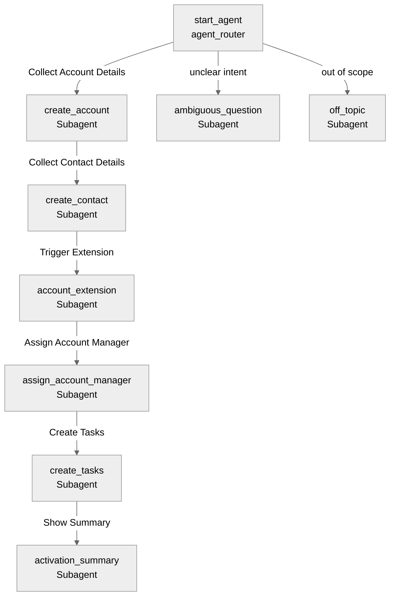

# Agent Spec: Customer_Account_Onboarding_Agent

## Purpose & Scope

The Customer Account Onboarding Agent assists Sales Executives in onboarding new retailer/customer accounts efficiently. It operates in the sales domain, collecting and validating account details, creating contact records, triggering account extension logic, assigning account managers, generating onboarding tasks, and finally providing a complete onboarding summary.

## Behavioral Intent

- The agent is professional, guided, and conversational.
- It asks one question at a time and confirms important actions before execution.
- It must gather all mandatory account fields (Name, Mobile, Email, Address, City, State, Postal Code, Country) and validate email and mobile formats before creating an Account.
- It must gather all mandatory contact fields (Name, Email, Mobile, Designation, Primary Point of Contact) and validate email and mobile formats before creating a Contact linked to the Account.
- It must execute an Account Extension batch/trigger (using an Apex class) and verify its completion.
- It assigns an active User as an Account Manager.
- It must generate specific onboarding tasks for Sales, Finance, and Distribution teams.
- It should minimize manual effort for the Sales Executive.
- It must handle errors gracefully (e.g., validation failures) and allow the user to retry or correct data.

## Configuration

- **developer_name:** `Customer_Account_Onboarding_Agent`
- **agent_label:** `Customer Account Onboarding Agent`
- **agent_type:** `AgentforceEmployeeAgent` (Since it's used by Sales Executives)
- **default_agent_user:** N/A (employee agent)

## Subagent Map

## Variables

- `account_id` (string = "") — The created Account ID. Set by: `create_account` action. Read by: all subsequent actions.
- `contact_id` (string = "") — The created Contact ID. Set by: `create_contact` action.
- `account_extension_status` (string = "") — Status of the Account Extension creation. Set by: `verify_account_extension` action.
- `account_manager_id` (string = "") — User ID of the assigned Account Manager. Set by: `search_and_assign_manager` action.
- `tasks_created` (boolean = False) — Indicates if tasks have been created. Set by: `create_onboarding_tasks` action.

## Actions & Backing Logic

### create_account (create_account subagent)

- **Target:** `apex://CreateAccountAction` (proposed)
- **Backing Status:** NEEDS STUB

#### Inputs

| Name | Type | Required | Source |
|------|------|----------|--------|
| accountName | string | Yes | User input |
| mobileNumber | string | Yes | User input |
| emailAddress | string | Yes | User input |
| address | string | Yes | User input |
| city | string | Yes | User input |
| state | string | Yes | User input |
| postalCode | string | Yes | User input |
| country | string | Yes | User input |

#### Outputs

| Name | Type | Visible to User? | Source | Notes |
|------|------|-------------------|--------|-------|
| accountId | string | No | `Account` | The created Account ID |
| success | boolean | No | Computed | |
| errorMessage | string | Yes | Computed | Validation errors |

### create_contact (create_contact subagent)

- **Target:** `apex://CreateContactAction` (proposed)
- **Backing Status:** NEEDS STUB

#### Inputs

| Name | Type | Required | Source |
|------|------|----------|--------|
| accountId | string | Yes | Context |
| contactName | string | Yes | User input |
| emailAddress | string | Yes | User input |
| mobileNumber | string | Yes | User input |
| designation | string | Yes | User input |
| isPrimary | boolean | Yes | User input |

#### Outputs

| Name | Type | Visible to User? | Source | Notes |
|------|------|-------------------|--------|-------|
| contactId | string | No | `Contact` | The created Contact ID |
| success | boolean | No | Computed | |
| errorMessage | string | Yes | Computed | Validation errors |

### trigger_account_extension (account_extension subagent)

- **Target:** `apex://TriggerAccountExtensionAction` (proposed - waiting for Batch class from User)
- **Backing Status:** NEEDS STUB

#### Inputs

| Name | Type | Required | Source |
|------|------|----------|--------|
| accountId | string | Yes | Context |

#### Outputs

| Name | Type | Visible to User? | Source | Notes |
|------|------|-------------------|--------|-------|
| extensionId | string | No | `cgcloud__Account_Extension__c` | Created extension ID |
| success | boolean | Yes | Computed | |
| errorMessage | string | Yes | Computed | |

### search_and_assign_manager (assign_account_manager subagent)

- **Target:** `apex://AssignAccountManagerAction` (proposed)
- **Backing Status:** NEEDS STUB

#### Inputs

| Name | Type | Required | Source |
|------|------|----------|--------|
| accountId | string | Yes | Context |
| searchName | string | No | User input |

#### Outputs

| Name | Type | Visible to User? | Source | Notes |
|------|------|-------------------|--------|-------|
| assignedUserId | string | No | `User` | Selected User ID |
| assignedUserName | string | Yes | `User` | Name of assigned manager |
| success | boolean | No | Computed | |
| errorMessage | string | Yes | Computed | |

### create_onboarding_tasks (create_tasks subagent)

- **Target:** `apex://CreateOnboardingTasksAction` (proposed)
- **Backing Status:** NEEDS STUB

#### Inputs

| Name | Type | Required | Source |
|------|------|----------|--------|
| accountId | string | Yes | Context |

#### Outputs

| Name | Type | Visible to User? | Source | Notes |
|------|------|-------------------|--------|-------|
| success | boolean | No | Computed | |
| tasksCreated | integer | Yes | Computed | Count of tasks created |

## Gating Logic

- `create_contact` subagent transitions `available when @variables.account_id != ""`
- `account_extension` subagent transitions `available when @variables.contact_id != ""`
- `assign_account_manager` subagent transitions `available when @variables.account_extension_status == "Success"`
- `create_tasks` subagent transitions `available when @variables.account_manager_id != ""`
- `activation_summary` subagent transitions `available when @variables.tasks_created == True`

## Architecture Pattern

**Linear Flow:**
The agent guides the user through a linear step-by-step wizard (Account -> Contact -> Extension -> Manager -> Tasks -> Summary). The flow enforces strict progression based on data collection.
