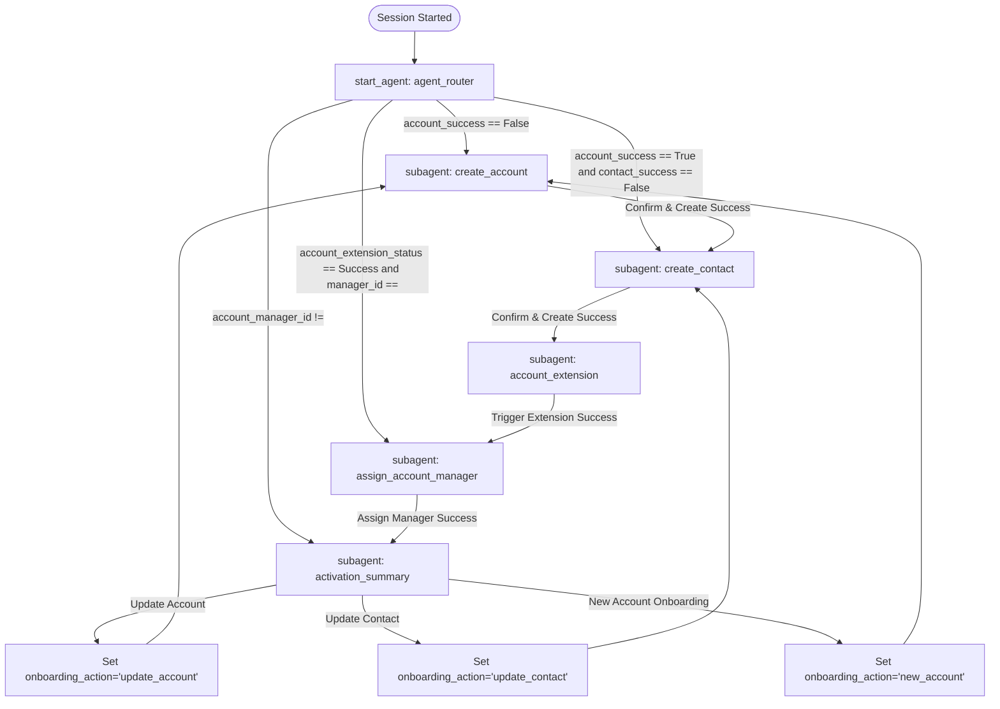

# Customer Onboarding Agent: Architecture and Flows

This document details the architecture, conversation flows, state transitions, variables, and Autolaunched Flows for the active **Customer Onboarding** agent.

---

## 1. Agent Overview
- **Developer Name**: `Customer_Onboarding`
- **Label**: `Customer Onboarding`
- **Agent Type**: `AgentforceEmployeeAgent`
- **Backing LLM Model**: `model://sfdc_ai__DefaultBedrockAnthropicClaude45Sonnet`
- **System Instructions**: Configured as an onboarding assistant for Sales Representatives. It collects specific onboarding details step-by-step, validating information inline.
- **Welcome Message**: `"Let's get started with the customer account setup.\n\nWhat is the account Full Name?"`

---

## 2. Conversation Flow & State Machine
The agent manages the customer onboarding process via a state machine of subagents. The flow is designed to be linear and state-driven, with options to update details or start a new onboarding flow at the end.

---

## 3. Session Variables
The session state is stored in the following variables:

| Variable Name | Type | Initial Value | Purpose / Logic |
|---|---|---|---|
| `account_id` | `mutable string` | `""` | The created Account Record ID. |
| `contact_id` | `mutable string` | `""` | The created Contact Record ID. |
| `account_extension_status` | `mutable string` | `""` | Status of the background account extension processing (`"Success"`). |
| `account_manager_id` | `mutable string` | `""` | Salesforce User ID of the assigned Account Manager. |
| `account_manager_name` | `mutable string` | `""` | Display name of the assigned Account Manager. |
| `account_success` | `mutable boolean` | `False` | Creation success status of the Account record. |
| `contact_success` | `mutable boolean` | `False` | Creation success status of the Contact record. |
| `onboarding_action` | `mutable string` | `""` | Tracks state updates/resets: `"update_account"`, `"update_contact"`, `"new_account"`. |

---

## 4. Subagents Logic & Behaviors

### 4.1. `agent_router` (Entry Point)
- Evaluates the variables in a `before_reasoning` hook and immediately transitions to the appropriate step without generating text output.
- Serves as the central state router.

### 4.2. `create_account`
- **Fields Collected**:
  1. Account Name
  2. Mobile Number (strictly 10 digits; validated inline)
  3. Email Address (must match regex `.+@.+\..+`; validated inline)
  4. Complete Address (Street, City, State/Province, Zip/Postal Code, Country; parsed from single line or requested individually)
- **Inline Validation**:
  - Validates email and phone formats before moving to the next field.
- **Typo Handling on Confirmation**:
  - Displays the summary and asks for the exact word `"CONFIRM"`.
  - Misspellings (e.g., `"cofirm"`, `"Conirm"`, `"comfirm"`, `"confirmm"`, `"confrim"`) trigger: `"I didn't recognize that confirmation. Please type CONFIRM to create this account, or let me know what needs to be changed."`
- **Reset Logic**:
  - If `onboarding_action == "new_account"`, resets all variables (`account_id`, `contact_id`, etc.) to clear state and starts a new onboarding.
  - If `onboarding_action == "update_account"`, resets `account_success = False` to allow editing.

### 4.3. `create_contact`
- **Fields Collected**:
  1. Contact Name
  2. Contact Email Address (validated inline)
  3. Contact Mobile Number (strictly at least 10 digits; validated inline)
  4. Designation / Role
  5. Primary Contact (Yes/No)
- **Typo Handling on Confirmation**:
  - Misspellings of `"CONFIRM"` trigger: `"I didn't recognize that confirmation. Please type CONFIRM to create this contact, or let me know what needs to be changed."`
- **Reset Logic**:
  - If `onboarding_action == "update_contact"`, resets `contact_success = False` to allow editing.

### 4.4. `account_extension` (Silent Pass-through)
- Immediately calls the `Trigger_Account_Extension_Onboarding` flow, updates `account_extension_status` to `"Success"`, and transitions to `assign_account_manager` without LLM reasoning or chat interaction.

### 4.5. `assign_account_manager` (Silent Pass-through)
- Immediately calls the `Assign_Account_Manager_Onboarding` flow to assign a manager.
- Passes `searchName = ""` to default the assignment to the **running User** (`$User.Id`) and returns their display name.
- Transitions to `activation_summary` silently.

### 4.6. `activation_summary` (End-of-Onboarding Options)
- Renders the complete summary. Uses `account_manager_name` as the manager (instead of a static string like "Sales Representative").
- Excludes the ready/active boilerplate sentence.
- Ends with: `"Is there anything you would like to update in this account or contact, or do you want to create a new account?"`
- Defines actions `prepare_update_account`, `prepare_update_contact`, and `prepare_new_account` to set the `onboarding_action` variable and route the user to the correct subagent in `after_reasoning`.

---

## 5. Declarative Autolaunched Flows (Actions)
All Apex action classes from the old agent were deleted and replaced with native Salesforce Autolaunched Flows:

### 1. `Create_Account_Onboarding`
- **Target**: `flow://Create_Account_Onboarding`
- **Inputs**: `accountName`, `mobileNumber`, `emailAddress`, `address`, `city`, `state`, `postalCode`, `country`.
- **Outputs**: `accountId`, `success`, `errorMessage`.
- **Logic**: Implements validations for email format (`.+@.+\..+`) and mobile number (10 digits). Creates the `Account` record and maps billing details. On failure, returns `success = false` with the error description.

### 2. `Create_Contact_Onboarding`
- **Target**: `flow://Create_Contact_Onboarding`
- **Inputs**: `accountId`, `contactName`, `emailAddress`, `mobileNumber`, `designation`, `isPrimary`.
- **Outputs**: `contactId`, `success`, `errorMessage`.
- **Logic**: Splits `contactName` into `FirstName` and `LastName` using string parsing formulas. Associates with the parent Account and inserts the `Contact` record.

### 3. `Trigger_Account_Extension_Onboarding`
- **Target**: `flow://Trigger_Account_Extension_Onboarding`
- **Inputs**: `accountId`.
- **Outputs**: `extensionId`, `success`, `errorMessage`.
- **Logic**: Inserts a custom `cgcloud__Account_Extension__c` record associated with the account, executing backend provisioning processes.

### 4. `Assign_Account_Manager_Onboarding`
- **Target**: `flow://Assign_Account_Manager_Onboarding`
- **Inputs**: `accountId`, `searchName`.
- **Outputs**: `assignedUserId`, `assignedUserName`, `success`, `errorMessage`.
- **Logic**: Searches for an active `User` matching the input. Defaults to the running User (`$User.Id`) when blank, updates the `OwnerId` of the account, and outputs the manager's Name.

---

## 6. Old Agent Cleanup & Deletion Record
The old metadata and logic classes were completely deleted to keep the local project and org clean:

### Deleted Agent Bundle
- `Customer_Account_Onboarding_Agent` bundle folder.
  - Files: `Customer_Account_Onboarding_Agent.agent` and `Customer_Account_Onboarding_Agent.bundle-meta.xml`.
  - Deleted from local and org.

### Deleted Apex Action Classes
The following 5 Apex classes and their `-meta.xml` metadata files were deleted:
1. `CreateAccountAction.cls`
2. `CreateContactAction.cls`
3. `TriggerAccountExtensionAction.cls`
4. `AssignAccountManagerAction.cls`
5. `CreateOnboardingTasksAction.cls`

### Deletion Procedure Details
- **Local Removal**: Removed files from `force-app/main/default/classes/` and `force-app/main/default/aiAuthoringBundles/`.
- **Org Metadata Clean**: Deleted the remote `Customer_Account_Onboarding_Agent` bot and planner dependencies via Salesforce Setup, allowing clean undeployment of the associated GenAiFunctions.
- **Destructive Deployment**: Ran a destructive changes deploy to delete the Apex classes from sandbox `CGCSBX` to ensure no orphaned compile blockers exist.
