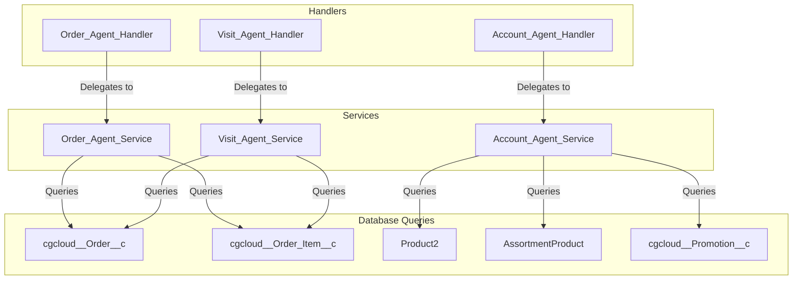

# Agentforce Order and Product Recommendation Logic Documentation

This document provides a comprehensive analysis of the **Order-related** and **Order Recommendation-related** logic, instructions, actions, and dependent Apex classes/methods within the `CGC_Intelligence` and `Visit_Intelligence` Agentforce agents.

---

## 1. Agent-Level Logic & Instructions

Both agent configurations specify strict instructions for when and how the agent should handle orders, retrieve summaries, and suggest products.

### A. Order-Related Logic & Rules
In the reasoning instructions for both agents (specifically under the `visit_intelligence` and `cgc_intelligence` subagents), the following logic is enforced:

*   **Order History & Purchasing Patterns:** If a user asks about order history, purchasing patterns, or what the customer usually orders, the agent must call the `order_summary` action (which routes to `get_order_summary`).
*   **Visit-Specific Orders:** If a user asks about orders associated with the active visit context, the agent must call the `get_visit_orders` action.
*   **Presentation and Formatting Constraint:** 
    > [!IMPORTANT]
    > When presenting the outputs of `order_summary` or `get_visit_orders`, the agent **must not** write any introductory summaries, headers, or repeated lists of spend/order counts. It must directly display the raw values of the action's outputs (`buyingInsight`, `phaseBreakdown`, and `recentOrders`) in a clean, single markdown block.
*   **Order Line Items:** If asked for products inside a specific order, the agent must call the `get_order_items` / `order_items` action with `orderId`.
*   **Order Notes Updates:** If asked to update delivery notes, invoice notes, or both, the agent must call `update_order_notes` (requires explicit user confirmation).
*   **Store Briefing Rule:** When asked for a store brief, store overview, pre-visit briefing, or store summary, the agent must call **only** `store_brief` (which maps to `get_store_brief`). It is prohibited from calling other actions in parallel (such as `get_details`, `get_counts`, or `order_summary`) or displaying tables of all past visits/orders. It must focus entirely on the metrics and takeaways returned by `store_brief`.
*   **Order Page Navigation Context (CGC Intelligence Agent Only):**
    *   If the agent is opened from an Order record page (`cgcloud__Order__c`), it retrieves order/account details and greets the user: *"I found the current order [Order Name] for [Account Name]. How can I help you?"*
    *   If the user searches for orders, it calls `find_orders`, presents results as a numbered list, and prompts: *"Which order would you like to select? Reply with the number."*
    *   When selected, it calls `select_order` to bind `orderId`, `accountId`, `accountName`, `orderName`, and `orderStatus` to variables.

### B. Order Recommendation (Product Suggestion) Rules
When users request product suggestions (e.g. *"what should I order"*, *"what is missing"*, *"product recommendations"*):
*   The agent must invoke the `suggest_products` action.
*   **Preservation Constraint:**
    > [!IMPORTANT]
    > The agent **must** output the exact text returned by the action line-by-line. It must **not** add markdown bolding (`**`), rewrite the suggestions into tables, or collapse/alter any newlines returned by the action.

---

## 2. Agent Actions Map

Here is the exact action schema mapped in the `.agent` definition files:

| Action Developer Name | Target Invocable | Action Type Parameter | Key Inputs | Key Outputs | Description |
| :--- | :--- | :--- | :--- | :--- | :--- |
| `order_summary` | `apex://Order_Agent_Handler` | `getAccountSummary` | `accountId` | `totalOrders`, `totalSpend`, `buyingInsight`, `phaseBreakdown`, `recentOrders` | Retrieves historical order trends, top products, and recent orders. |
| `get_visit_orders` | `apex://Order_Agent_Handler` | `getVisitSummary` | `visitId` | `totalOrders`, `totalSpend`, `buyingInsight`, `phaseBreakdown`, `recentOrders` | Retrieves order summaries specifically linked to a Visit ID. |
| `get_order_items` / `order_items` | `apex://Order_Agent_Handler` | `getLineItems` | `orderId` | `itemCount`, `itemsSummary` | Lists product line items, quantities, and UOMs for a specific order. |
| `update_order_notes` | `apex://Order_Agent_Handler` | `updateNotes` | `orderIdentifier`, `deliveryNote`, `invoiceNote` | `success`, `resultMessage` | Updates notes on a specific order (requires user confirmation). |
| `suggest_products` | `apex://Account_Agent_Handler` | `suggestProducts` | `accountId` | `recommendations` | Generates a prioritized list of recommended catalog items. |
| `get_store_brief` | `apex://Visit_Agent_Handler` | `getStoreBrief` | `visitId`, `accountId` | `summary` | Compiles visit status, last visit date, recent orders, and top products. |
| `get_order` / `select_order` | `apex://Order_Agent_Handler` | `getDetails` | `orderId` | `orderId`, `accountId`, `accountName`, `orderName`, `orderStatus` | Loads context metadata when navigating to or selecting an Order page. |
| `find_orders` | `apex://Order_Agent_Handler` | `search` | `searchQuery` | `orders` (List of options) | Searches orders by order name or account name. |

---

## 3. Dependent Apex Classes and Methods

The following figure visualizes the dependency flow:



### Class: [Order_Agent_Handler](file:///c:/Users/Bhanu%20Bobba/Documents/CGCCloud/CGCMain/CGCLOUD/force-app/main/default/classes/Order_Agent_Handler.cls)
This class serves as the invocable router for order actions. It accepts a list of `Request` transfer objects, extracts the `actionType`, and calls the corresponding method on the `Order_Agent_Service` class.

*   **Method:** `execute(List<Request> requests)`
    *   Iterates through requests.
    *   Routes to `Order_Agent_Service` methods based on `req.actionType.toLowerCase()`:
        *   `'getdetails'` $\rightarrow$ `Order_Agent_Service.getOrderDetails(req.orderId)`
        *   `'search'` $\rightarrow$ `Order_Agent_Service.searchOrders(req.searchQuery)`
        *   `'getaccountsummary'` $\rightarrow$ `Order_Agent_Service.getAccountOrderSummary(req.accountId)`
        *   `'getvisitsummary'` $\rightarrow$ `Order_Agent_Service.getVisitOrderSummary(req.visitId)`
        *   `'getlineitems'` $\rightarrow$ `Order_Agent_Service.getOrderLineItems(req.orderId)`
        *   `'updatenotes'` $\rightarrow$ `Order_Agent_Service.updateOrderNotes(...)`

### Class: [Order_Agent_Service](file:///c:/Users/Bhanu%20Bobba/Documents/CGCCloud/CGCMain/CGCLOUD/force-app/main/default/classes/Order_Agent_Service.cls)
Implements query execution and data formatting for all order actions.

*   **Method:** `getOrderDetails(String orderId)`
    *   *SOQL Query:* Queries `cgcloud__Order__c` matching `Id = :orderId`.
    *   *Returns:* Order metadata (ID, Account ID/Name, Name, Status/Phase).
*   **Method:** `searchOrders(String searchQuery)`
    *   *SOQL Query:* Searches `cgcloud__Order__c` where `Name LIKE :pattern OR cgcloud__Order_Account__r.Name LIKE :pattern` with a limit of 15.
    *   *Returns:* A list of `OrderOption` objects containing labels formatted as: `"Order [Name] — [Account Name] (Status: [Phase])"`.
*   **Method:** `getAccountOrderSummary(String accountId)`
    *   *SOQL Query:* Queries up to 10 orders associated with the Account, sorting by `CreatedDate DESC`. It performs an inner subquery on the child relationship `cgcloud__Order_Items__r` (querying `cgcloud__Product__r.Name`, `cgcloud__Quantity__c`, `cgcloud__UOM__c`).
    *   *Logic:*
        *   Aggregates total spent using `cgcloud__Total_Value__c`.
        *   Calculates percentage of spend per order Phase (e.g. Draft, Released, Canceled) for the `phaseBreakdown` section.
        *   Aggregates ordered quantities and order frequencies in a `ProductStat` map.
        *   Determines the **Top-Selling Product** (highest quantity sum) and **Usually purchases** items (top 2 by order frequency).
        *   Outputs formatted markdown tables, spend overviews, and recent order item lists.
*   **Method:** `getVisitOrderSummary(String visitId)`
    *   *SOQL Query:* Queries the top 10 orders matching `cgcloud__Visit__c = :visitId`. Includes subqueries for child items and columns for `cgcloud__Delivery_Note__c` and `cgcloud__Invoice_Note__c`.
    *   *Logic:* Identical aggregation logic to `getAccountOrderSummary`, but filtered on the specific Visit context and appends order delivery and invoice notes to the order information blocks.
*   **Method:** `getOrderLineItems(String orderId)`
    *   *SOQL Query:* Queries child line items from `cgcloud__Order_Item__c` where parent `cgcloud__Order__c = :orderId`, sorted alphabetically by product name.
    *   *Returns:* A formatted markdown list (`itemsSummary`) of items containing product names, quantities, and units of measure.
*   **Method:** `updateOrderNotes(String orderIdentifier, String deliveryNote, String invoiceNote)`
    *   *SOQL Query:* Queries `cgcloud__Order__c` by ID or by `Name` if the identifier is not a standard ID length.
    *   *DML Update:* Performs a database update under `USER_MODE` setting fields `cgcloud__Delivery_Note__c` and/or `cgcloud__Invoice_Note__c`.

---

### Class: [Account_Agent_Service](file:///c:/Users/Bhanu%20Bobba/Documents/CGCCloud/CGCMain/CGCLOUD/force-app/main/default/classes/Account_Agent_Service.cls)
Implements product catalog analysis and scoring to suggest products.

*   **Method:** `suggestProducts(String accountId)`
    *   *Logic Flow:*
        1.  **Extract Store Catalog:** Attempts to query assortments linked to the Account through custom junction `cgcloud__Product_Assortment_Store__c` or standard junction `StoreAssortment`. It maps these to query active child products from `AssortmentProduct`. If no assortment is found, it falls back to a query of the active global `Product2` catalog (limit 50).
        2.  **Order Frequency Map:** Queries the last 50 orders for the Account (subquerying `cgcloud__Product__c` on line items) to compute how many orders contained each product.
        3.  **Active Promotions:** Queries active promotions for the Account (`cgcloud__Anchor_Account__c = :accId AND cgcloud__Active__c = true`) and fetches promoted product IDs via associated `cgcloud__Tactic_Product__c` records.
        4.  **Scoring Algorithm:** Scores each catalog product based on custom business criteria:
            *   *Active Promotion:* **+50 points**
            *   *Most Ordered Product (Top Frequency):* **+40 points**
            *   *Frequently Ordered:* **+25 points**
            *   *Top Categories (Beverages/Snacks):* **+20 points**
            *   *Seasonal Product (Name contains "summer"/"winter"):* **+10 points**
            *   *Mock Demands (Fallback):* If a product has 0 points, it applies regional rules based on string character checks to mimic regional/trending demand (+15, +25, or +35 points).
        5.  **Sorting & Formatting:** Sorts products descending by score. Compiles the top 5 products into a numbered list formatted in markdown, explicitly displaying the recommendation reason and final score.

---

### Class: [Visit_Agent_Service](file:///c:/Users/Bhanu%20Bobba/Documents/CGCCloud/CGCMain/CGCLOUD/force-app/main/default/classes/Visit_Agent_Service.cls)
Implements visit-related logic, including order summaries embedded in store briefs and visit reports.

*   **Method:** `getStoreBrief(String visitId, String accountId)`
    *   *SOQL Query:* Queries the 3 most recent orders for the Account, summing `cgcloud__Total_Value__c`.
    *   *Aggregate Query:* Runs an aggregate query on `cgcloud__Order_Item__c`:
        ```apex
        SELECT cgcloud__Product__r.Name product_name, SUM(cgcloud__Quantity__c) qty 
        FROM cgcloud__Order_Item__c 
        WHERE cgcloud__Order__r.cgcloud__Order_Account__c = :accId 
        GROUP BY cgcloud__Product__r.Name 
        ORDER BY SUM(cgcloud__Quantity__c) DESC 
        LIMIT 3
        ```
    *   *Logic:* Integrates these metrics to display recent order counts, total spend, and a numbered list of the top 3 products.
*   **Method:** `generateVisitSummary(String visitId)`
    *   *SOQL Query:* Queries orders tied to `cgcloud__Visit__c = :visitId`.
    *   *Logic:* Calculates total orders created during the visit and aggregates the gross value of those orders. This value is printed in a bulleted summary report and updated into the `cgcloud__Note__c` field on the `Visit` record.
