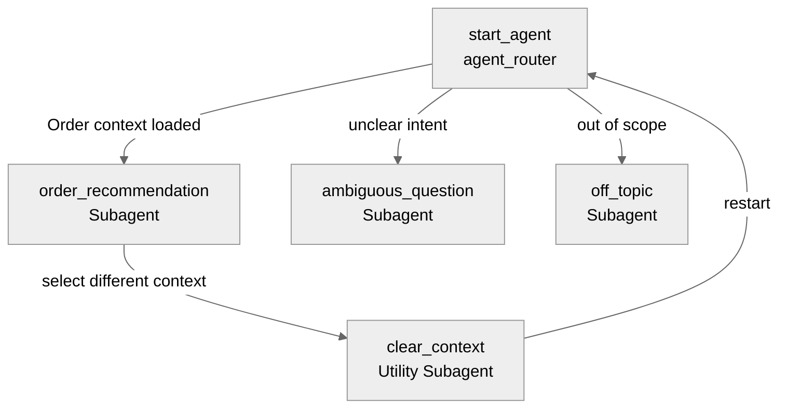

# Agent Spec: Smart_Order_Recommendation

## Purpose & Scope

The Smart Order Recommendation Agent is designed for Consumer Goods Cloud Sales Representatives. It operates in the context of an Order record page (`cgcloud__Order__c`), identifies the associated Account (Retail Store), and provides prioritized product recommendations. 

The agent analyzes product assortments, historical purchase data, gap analysis, replenishment needs, and similar store patterns to recommend missing products and quantities, ranking them by business impact (confidence score 0-100) across 8 specific categories.

---

## Behavioral Intent

*   **Context Initialization:** The agent must automatically extract and load context when opened from an Order record page (`cgcloud__Order__c`).
*   **Prioritized Recommendations:** The agent must prioritize sellable assortment products (active, sellable, assigned to assortment, and in the current Price Book) before considering broader cross-sell or upsell opportunities.
*   **Direct Presentation:** 
    > [!IMPORTANT]
    > When presenting recommendations or store gaps, the agent must output the exact text returned by the action line-by-line. It must **not** add markdown bolding (`**`), rewrite recommendations into tables, or collapse any newlines returned by the service.
*   **Support & Boundaries:** The agent redirects off-topic or general knowledge questions to its core capabilities (order recommendations, assortment gaps, replenishment).

---

## Subagent Map

---

## Variables

*   `currentRecordId` (mutable string = ""): Tracks the current Salesforce record ID from the page context.
*   `currentObjectApiName` (mutable string = ""): Tracks the current object API name (e.g. `"cgcloud__Order__c"`).
*   `orderId` (mutable string = ""): Tracks the active Order ID.
*   `accountId` (mutable string = ""): Tracks the Retail Store Account ID associated with the Order.
*   `accountName` (mutable string = ""): Tracks the Name of the Retail Store.
*   `orderName` (mutable string = ""): Tracks the Name/Number of the Order.
*   `orderStatus` (mutable string = ""): Tracks the current Phase/Status of the Order.

---

## Actions & Backing Logic

### get_order_context (agent_router start_agent)

*   **Target:** `apex://Order_Recommendation_Handler`
*   **Backing Status:** NEEDS STUB
*   **Description:** Retrieves order and account details from the active page context.

#### Inputs

| Name | Type | Required | Source |
|------|------|----------|--------|
| agentName | string | Yes | Static: `"Smart_Order_Recommendation"` |
| actionType | string | Yes | Static: `"getContext"` |
| orderId | string | Yes | Page context `currentRecordId` |

#### Outputs

| Name | Type | Visible to User? | Source | Notes |
|------|------|-------------------|--------|-------|
| orderId | string | No | `cgcloud__Order__c.Id` | Selected Order ID |
| accountId | string | No | `cgcloud__Order__c.cgcloud__Order_Account__c` | Associated Account ID |
| accountName | string | Yes | `cgcloud__Order__c.cgcloud__Order_Account__r.Name` | Retail Store Name |
| orderName | string | Yes | `cgcloud__Order__c.Name` | Order Number |
| orderStatus | string | Yes | `cgcloud__Order__c.cgcloud__Phase__c` | Current Order Phase |

---

### suggest_order_products (order_recommendation subagent)

*   **Target:** `apex://Order_Recommendation_Handler`
*   **Backing Status:** NEEDS STUB
*   **Description:** Implements the 7-step core recommendation engine to analyze assortments, history, gaps, replenishment, and similar store patterns.

#### Inputs

| Name | Type | Required | Source |
|------|------|----------|--------|
| agentName | string | Yes | Static: `"Smart_Order_Recommendation"` |
| actionType | string | Yes | Static: `"suggestProducts"` |
| accountId | string | Yes | `@variables.accountId` |
| orderId | string | Yes | `@variables.orderId` |

#### Outputs

| Name | Type | Visible to User? | Source | Notes |
|------|------|-------------------|--------|-------|
| recommendations | string | Yes | Computed | Formatted markdown text with categorized recommendations |

#### Stubbing Requirement
Requires the creation of a new Apex Class `Order_Recommendation_Handler` and `Order_Recommendation_Service`.
*   Input wrappers: `agentName`, `actionType`, `orderId`, `accountId`.
*   Output wrappers: `orderId`, `accountId`, `accountName`, `orderName`, `orderStatus`, `recommendations`.
*   Service logic must implement query mapping:
    1.  Query `cgcloud__Order__c` to identify the Account.
    2.  Retrieve Assortment Products (`AssortmentProduct` linked to store assortments).
    3.  Analyze past orders for the account to establish historical statistics (Ordered Products, Frequency, Quantities).
    4.  Perform Gap Analysis (Assortment MINUS Ordered).
    5.  Perform Replenishment Analysis.
    6.  Group and rank recommendations into the 8 requested categories.

---

## Gating Logic

No conditional actions require gates. All actions are available when the subagent context is active.

---

## Architecture Pattern

This agent uses the **Hub-and-Spoke** architecture pattern:
*   **Hub:** The `agent_router` subagent inspects page context, loads variables, and transitions to spokes.
*   **Spokes:** 
    *   `order_recommendation` (Domain subagent)
    *   `off_topic` (Guardrail subagent)
    *   `ambiguous_question` (Guardrail subagent)
    *   `clear_context` (Utility subagent to reset state)

---

## Agent Configuration

*   **developer_name:** `Smart_Order_Recommendation`
*   **agent_label:** `Smart Order Recommendation`
*   **agent_type:** `AgentforceEmployeeAgent` (Internal utility for sales reps)
*   **default_agent_user:** N/A (Not required for employee agent type)
