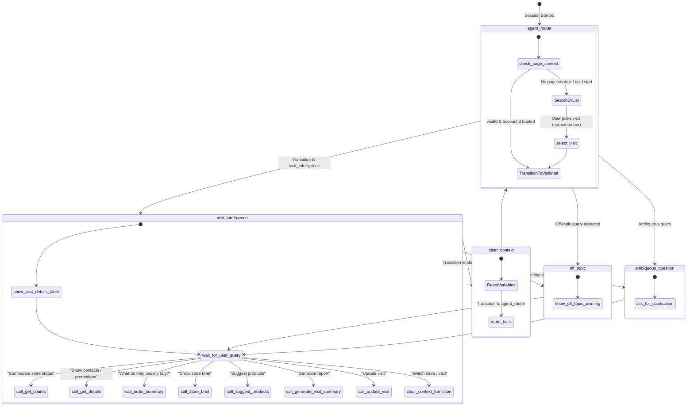

Visit Intelligence Agent Analysis & Syntax Guide 
This document provides a comprehensive analysis of the Visit Intelligence Agent, explaining Agent Script syntax, the purpose of each block in Visit_Intelligence.agent, subagent behaviors, and the design and logic of all underlying Apex classes and Flow backing actions.
1. Agent Script Syntax & Execution Model Guide
Agent Script is Salesforce's scripting language for authoring next-generation AI agents running on the Atlas Reasoning Engine. It uses a YAML-like structure with specific grammar rules and flow control.
Block Structure & Ordering
An Agent Script file is compiled sequentially and must strictly adhere to the following block ordering:
system: — Global system instructions, welcome message, and fallback error messages.
config: — Configuration variables like the agent name, label, description, and execution context.
model_config: (Optional / Platform Default) — Selects the backing LLM model.
variables: — Shared, mutable data storage variables scoped to the session.
language: — Configures locale settings (e.g., default_locale).
start_agent: — Defines the entry point subagent (also called the router) that handles initial requests.
subagent: — Modules specialized for handling specific conversational domains.
actions: — Local action declarations (e.g. Apex, Flow, or Prompt template backends) defined either within a subagent or globally.
Basic Syntax Rules
Indentation: Must be exactly 4 spaces per indent level. Do NOT use tabs, as it will cause a compilation error.
Strings: All string literals must be double-quoted (e.g. "Visit Intelligence"). Multiline strings utilize the block scalar indicator |.
Booleans: Booleans must be capitalized: True or False.
Variables: Reference session-level variables using @variables.variableName (e.g., @variables.visitId).
Subagents: Referenced with @subagent.subagentName.
Actions: Local actions are referenced with @actions.actionName.
Ephemeral Bindings: Inside reasoning blocks, parameters from action outputs are referenced using @outputs.paramName and only live immediately within the transition or set statement following that action. Inputs are passed using the with keyword.
2. Block-by-Block Explanation of Visit_Intelligence.agent
Let's dissect Visit_Intelligence.agent section-by-section.
2.1. system: Block
Defines the agent's identity, behavior instructions, and default system strings.
system:
    instructions: |
        You are a Salesforce Visit Intelligence Agent operating within the current Salesforce org.
        Your primary objective is to assist internal users (supervisors and field reps) with analysis of
        Visit records and their associated Accounts.
        Always maintain a professional, helpful, and concise tone.
    messages:
        welcome: "Hi! I am the CGC Visit Intelligence Agent. I can help you summarize and detail
                 related records for the current Visit and its Account. How can I assist you today?"
        error: "An error occurred. Please try again."
Purpose: Ground the LLM's core personality and set user expectations with a friendly greeting and error strings.
2.2. config: Block
Defines metadata configurations for publishing the bundle inside Salesforce.
config:
    developer_name: "Visit_Intelligence"
    agent_label: "Visit Intelligence"
    description: "Operates within a Visit context, retrieving related Account context and
                 summarizing or detailing records."
    agent_type: "AgentforceEmployeeAgent"
Purpose:
developer_name: Unique API name of the metadata bundle.
agent_type: Set to AgentforceEmployeeAgent, meaning it operates on behalf of an internal Salesforce employee (e.g. Field Rep, Manager).
2.3. model_config: Block
model_config:
    model: "model://sfdc_ai__DefaultBedrockAnthropicClaude45Sonnet"
Purpose: Instructs the Atlas Engine to use Claude 4.5 Sonnet to process instructions and reason about actions.
2.4. variables: Block
Stores persistent execution context in memory.
variables:
    currentRecordId: mutable string = ""
        description: "The ID of the current record."
        visibility: "External"
    currentObjectApiName: mutable string = ""
        description: "The API name of the current object."
        visibility: "External"
    visitId: mutable string = ""
        description: "The ID of the current Visit."
    accountId: mutable string = ""
        description: "The ID of the Account associated with the current Visit."
    accountName: mutable string = ""
        description: "The Name of the Account associated with the current Visit."
    visitStatus: mutable string = ""
        description: "The Status of the current Visit."
    visitDate: mutable string = ""
        description: "The Date of the current Visit."
    assignedUser: mutable string = ""
        description: "The assigned user name for the current Visit."
Purpose:
Variables with visibility: "External" (currentRecordId, currentObjectApiName) automatically absorb the context of the Salesforce Lightning record page where the chat window is opened.
Other variables are internal session variables used to maintain the active Visit and Account.
3. Subagents & Conversation Flow
Subagents are individual conversation states. The agent transitions between these states as the context changes.
3.1. start_agent agent_router
The entry point. It evaluates initial page context or guides the user to locate a visit.
start_agent agent_router:
    description: "Route employees to the right subagent and initialize visit context."
    before_reasoning:
        if @variables.currentObjectApiName == "Visit" and @variables.currentRecordId != "" and @variables.visitId == "":
            set @variables.visitId = @variables.currentRecordId
        if @variables.accountId != "":
            transition to @subagent.visit_intelligence
Before Reasoning: If the user is on a Visit record page, it sets visitId immediately. If accountId is already loaded, it bypasses the router and jumps to the visit_intelligence subagent.
Reasoning instructions & actions:
If a visitId is loaded but there is no accountId, it calls get_visit_details to retrieve related info.
Once accountId is populated, it transitions to @subagent.visit_intelligence.
If starting cold, it lets the user list (list_visits) or search (find_visits) for visits. Once selected, it loads context via select_visit.
Contains default error fallbacks to transition to off_topic or ambiguous_question.
3.2. subagent visit_intelligence
The main functional module. Once a visit context is locked, this subagent handles user inquiries about the account.
Key Instructions:
- Formats responses with clear emojis, bold headings, tables, and lists.
- Shows an introductory table of the Visit and Account details immediately when context is loaded.
- Calls `get_counts` for high-level summaries.
- Calls `get_details` for lists of records (e.g. contacts, visits, tactics, assortments).
- Calls `order_summary` to retrieve insights on what the customer buys.
- Calls `get_visit_orders` to retrieve insights on orders associated specifically with the current visit.
- Calls `store_brief` to retrieve a consolidated store brief and audit summary.
- Calls `suggest_products` to generate a prioritized list of suggested or recommended products.
- Calls `generate_visit_summary` to create a structured visit report summarizing tasks, promotions, and orders.
- Calls `update_visit` to update the status, notes, timing, or owner of the active Visit record.
- Calls `search_users` to find a user before assigning a visit via `update_visit`.
- Allows the user to switch visits, which triggers a transition to `clear_context`.
3.3. subagent off_topic
Protects the LLM from executing non-business instructions.
Purpose: Explicitly instructs the agent to state it is specialized in Salesforce Visit Intelligence and politely decline general knowledge queries.
3.4. subagent ambiguous_question
Clarification layer.
Purpose: If the user request is ambiguous, it requests a focused query (e.g., asking if they want an Account summary or list of active promotions).
3.5. subagent clear_context
A utility subagent that performs cleanup.
subagent clear_context:
    description: "Utility subagent to clear the active Visit and Account context variables before selecting another visit."
    before_reasoning:
        set @variables.visitId = ""
        set @variables.accountId = ""
        ...
        transition to @subagent.agent_router
Purpose: When the user requests a store change, this subagent resets variables and moves the session back to agent_router to begin search/selection.
4. Backing Actions (Flows & Apex Classes)
Each action used by the agent is backed by a specific piece of metadata in Salesforce.
4.1. Get_Visit_Details.flow-meta.xml (Flow)
Target: flow://Get_Visit_Details
Purpose: Fetches basic data from the Visit record and its linked Retail Store / Account.
Inputs:
recordId (String) — The ID of the Visit record.
Outputs:
recordId (String) — Confirmed Visit ID.
accountId (String) — Parent Account ID.
accountName (String) — Name of the account.
visitStatus (String) — Current status (e.g. Open, Completed).
visitDate (String) — PlannedVisitStartTime.
assignedUser (String) — Name of the assigned user.
Internal Logic:
Looks up the Visit record by recordId.
If the Visit does not have a direct AccountId, it queries the linked RetailStore (via PlaceId) to find its associated AccountId.
Queries the Account name.
Resolves the assigned user's name by querying the User object (via cgcloud__Responsible__c or OwnerId).
4.2. GetAvailableVisits.cls (Apex Class)
Target: apex://GetAvailableVisits
Purpose: Returns scheduled and recently modified visits for the logged-in user.
Inputs:
dummyInput (String)
Outputs:
visits (List of VisitOption) — Contains visitId, accountName, label, category.
Internal Logic:
Queries Visit using 4 criteria:
Scheduled for Today (PlannedVisitStartTime = TODAY).
Scheduled in Next 7 Days.
Recently Modified/Viewed (ORDER BY LastModifiedDate DESC).
Owned by/Assigned to current user.
Dynamically checks if the namespace field cgcloud__Responsible__c is present to filter by the assigned rep.
Formats a detailed label string for each option with emojis (📅 Date, 📋 Status, 👤 Assigned).
Includes a fallback that returns structured Mock Visits if the query returns empty or throws an error.
4.3. SearchVisitsForAgent.cls (Apex Class)
Target: apex://SearchVisitsForAgent
Purpose: Provides natural language and keyword search capabilities across visits.
Inputs:
searchQuery (String) — User search string (e.g., "Reliance visits tomorrow", "reliance this week").
Outputs:
visits (List of VisitOption) — Matching visits.
Internal Logic:
Employs a text parser (parseSearchQuery) to isolate natural language date keywords (this week, next week, last week, this month, today, tomorrow, yesterday) and explicit formats (yyyy-MM-dd, dd/MM/yyyy, 29 May).
Segregates the query into a date query filter (applied on cgcloud__Start_Date__c) and a text search term (applied using LIKE on Account.Name, Name, or Status).
Restricts queries using WITH USER_MODE to obey user permissions.
4.4. GetAccountRelatedCounts.cls (Apex Class)
Target: apex://GetAccountRelatedCounts
Purpose: Fetches aggregate counts of related objects to show a health summary.
Inputs:
accountId (String)
Outputs:
totalContacts (Integer)
totalVisits (Integer)
pendingVisitTasks (Integer)
activePromotions (Integer)
outOfStockCount (Integer)
totalRetailStores (Integer)
totalAssortments (Integer)
totalStoreProducts (Integer)
totalTactics (Integer)
totalAssortmentProducts (Integer)
Internal Logic:
Executes isolated COUNT() SOQL queries against Contact, Visit, and Task (pending only).
Handles the Consumer Goods Cloud namespace dynamically: queries cgcloud__Promotion__c (active only) and cgcloud__Tactic__c.
Determines assortments by checking standard StoreAssortment records and custom cgcloud__Product_Assortment_Store__c stores.
Automatically loads high-quality Mock Counts (e.g. 13 visits, 3 tasks, 1 promotion, 6 assortment products) in empty sandbox/developer environments.
4.5. GetAccountRelatedRecords.cls (Apex Class)
Target: apex://GetAccountRelatedRecords
Purpose: Retrieves a detailed list of related records based on a specified category type.
Inputs:
accountId (String)
recordType (String) — Category choice (e.g. 'contacts', 'visits', 'promotions', 'outofstock', 'assortmentproducts').
Outputs:
records (List of RecordInfo) — Structures containing name, status, owner, and lastModified.
Internal Logic:
Executes specific queries depending on the requested recordType.
For assortmentproducts, queries standard AssortmentProduct linked to store assortments and pulls the product brand (cgcloud__Criterion_3_Product__r.Name).
For outofstock, queries visits where cgcloud__OOS_Issues__c is true.
Provides custom mock data structures for every record type to prevent failures when zero database records are returned.
4.6. GetAccountOrderSummaryForAgent.cls (Apex Class)
Target: apex://GetAccountOrderSummaryForAgent
Purpose: Summarizes purchasing history and aggregates sales metrics.
Inputs:
accountId (String)
Outputs:
totalOrders (Integer)
totalSpend (Decimal)
buyingInsight (String) — Text detailing frequent items & top sellers.
phaseBreakdown (String) — Spend aggregated by order state.
recentOrders (String) — Formatted text cards detailing the last 10 orders.
Internal Logic:
Queries the custom object cgcloud__Order__c alongside its sub-child items (cgcloud__Order_Items__r).
Computes a total historical order spend (cgcloud__Total_Value__c) and groups orders into phase categories (Draft, Submitted/Released, Canceled).
Processes product line items to identify frequent purchases (using a custom Comparable class ProductEntry sorted by purchase frequency) and denotes the single top-selling product.
4.7. GetOrderLineItems.cls (Apex Class)
Target: apex://GetOrderLineItems
Purpose: Fetches the exact items inside a given order.
Inputs:
orderId (String)
Outputs:
items (List of OrderItem) — List with productName, quantity, and uom.
itemCount (Integer)
itemsSummary (String) — A pre-formatted newline list of items.
Internal Logic:
Queries cgcloud__Order_Item__c filtering on cgcloud__Order__c = :orderId.
Formats quantity and UOM cleanly (e.g. Diet Soda 12oz Cans - 50 PCS).
4.8. UpdateOrderNotes.cls (Apex Class)
Target: apex://UpdateOrderNotes
Purpose: Update delivery notes and/or invoice notes on a specific CG Cloud Order by its ID or Name/Number.
Requires User Confirmation: True (forces the Agent UI to show a confirmation dialog to the user before writing data).
Inputs:
orderIdentifier (String) — The Salesforce Order ID or Order Name/Number.
deliveryNote (String) — New delivery note text (optional).
invoiceNote (String) — New invoice note text (optional).
Outputs:
success (Boolean)
resultMessage (String)
Internal Logic:
Queries `cgcloud__Order__c` by looking up the 15/18 char Salesforce Id or falling back to the Order Name.
Updates `cgcloud__Delivery_Note__c` and/or `cgcloud__Invoice_Note__c` if values are provided.
Executes a DML update statement in USER_MODE.

4.9. GetVisitOrderSummary.cls (Apex Class)
Target: apex://GetVisitOrderSummary
Purpose: Retrieve order history summary, buying insights, phase breakdown, and recent orders specifically for a given Visit ID.
Inputs:
visitId (String)
Outputs:
totalOrders (Integer)
totalSpend (Decimal)
buyingInsight (String)
phaseBreakdown (String)
recentOrders (String)
Internal Logic:
Similar to `GetAccountOrderSummaryForAgent` but filters the `cgcloud__Order__c` records using `cgcloud__Visit__c = :vstId` instead of the account.
Aggregates grand totals, groups by phase, and compiles product purchasing frequencies to generate an insight string.
Outputs clean markdown order cards with details like delivery dates and phase icons.

4.10. GetStoreBrief.cls (Apex Class)
Target: apex://GetStoreBrief
Purpose: Generate a consolidated store brief and audit summary for the current visit and account context.
Inputs:
visitId (String)
accountId (String)
Outputs:
summary (String) — Formatted markdown store brief.
Internal Logic:
Queries multiple tables to build a comprehensive brief: checks the last visit date, last 3 orders to calculate total spent, top products grouped by quantity, active promotions, open tasks, recent OOS issues, and pending surveys.
Outputs a clean markdown string listing Visit Status, Last Visit, Recent Orders, Top Products, etc. Include mock fallback data for robust sandbox execution.

4.11. SuggestProductsForStore.cls (Apex Class)
Target: apex://SuggestProductsForStore
Purpose: Get product recommendations for the active store based on catalog gaps and order history.
Inputs:
accountId (String)
Outputs:
recommendations (String) — Formatted list of recommended products.
Internal Logic:
Identifies products linked to the store's assortments (via custom or standard objects).
Calculates order frequency for each product and cross-references active promotions.
Implements a scoring mechanism: +50 for active promotions, +40 for most ordered, +25 for frequently ordered, +20 for top category (e.g. Beverages/Snacks), and +10 for seasonal.
Returns a ranked Top 5 recommendations list with descriptions of the scoring reasoning.

4.12. GenerateVisitSummary.cls (Apex Class)
Target: apex://GenerateVisitSummary
Purpose: Collect visit execution metrics and return a formatted visit report, writing it to the Visit record.
Inputs:
visitId (String)
Outputs:
visitSummary (String) — Generated visit summary text.
Internal Logic:
Aggregates metrics for the active visit: queries completed vs pending tasks, total active promotions, out-of-stock issues, and the number/value of orders created during the visit.
Concatenates this into a markdown string and writes it back directly to the `cgcloud__Note__c` field on the Visit object.

4.13. UpdateVisitDetails.cls (Apex Class)
Target: apex://UpdateVisitDetails
Purpose: Update fields on the current Visit record (Status, Notes, Times, and Owner).
Requires User Confirmation: True
Inputs:
visitId (String)
status, notes, startTime, endTime, ownerName, ownerId, ownerAlias, ownerProfileName, plannedStartTime, plannedEndTime (All Optional)
Outputs:
success (Boolean)
message (String)
Internal Logic:
Allows parsing of status commands (e.g., 'start' -> 'InProgress', 'end' -> 'Completed').
Updates notes by appending to `cgcloud__Note__c`.
Assigns users by resolving `ownerName` or `ownerId` against the `User` table, setting the standard `OwnerId` and the custom `cgcloud__Responsible__c`.
Executes a DML update on the `Visit` record.

4.14. SearchUsersForAgent.cls (Apex Class)
Target: apex://SearchUsersForAgent
Purpose: Search for users by name to retrieve details like ID, Alias, and Profile.
Inputs:
searchQuery (String)
Outputs:
users (List of UserOption) — ID, Name, Alias, Profile Name.
Internal Logic:
Performs a LIKE query on the `User` object (`Name LIKE :searchStr`) filtering for active users. Returns a list of matches to be presented to the user for selection.
5. Conversational Architecture Diagram
Below is the state transition diagram representing how the agent moves between subagents during a live conversation session: Excalidraw

