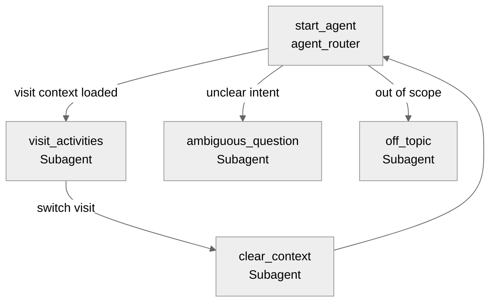

# Agent Spec: Visit_Activity_Agent

## Purpose & Scope

The **Visit Activity Agent** assists supervisors and field representatives in managing and querying activities, questions, and surveys associated with retail store visits. It enables users to fetch planned activities for a visit based on its visit template and track answered vs. pending questions/surveys.

## Behavioral Intent

- Greet the user and guide them to select or search for a Visit if one is not in the page context.
- Load visit details and the associated Account context.
- When asked for Today's activities, visit-related activities, or surveys, fetch the Visit's Template and query related activities (Job Definition Lists) along with their related questions/surveys (Job Definition Templates).
- When asked for answered, unanswered, or pending questions/surveys, query the associated Visit Jobs and filter them based on their completion status.
- Return structured, clear responses using markdown tables and emojis.
- Support switching visits by clearing the active context.

## Subagent Map

## Variables

- `currentRecordId` (mutable string = "") — Tracks the active record ID from page context.
- `currentObjectApiName` (mutable string = "") — Tracks the active object type from page context.
- `visitId` (mutable string = "") — The ID of the selected Visit.
- `accountId` (mutable string = "") — The ID of the Account associated with the Visit.
- `accountName` (mutable string = "") — The Name of the Account associated with the Visit.
- `visitStatus` (mutable string = "") — The Status of the current Visit.
- `visitDate` (mutable string = "") — The Date of the current Visit.
- `assignedUser` (mutable string = "") — The assigned user name for the current Visit.

## Actions & Backing Logic

### get_visit_details (agent_router)

- **Target:** `flow://Get_Visit_Details`
- **Backing Status:** EXISTS

#### Inputs

| Name | Type | Required | Source |
|------|------|----------|--------|
| recordId | string | Yes | Context / Variable |

#### Outputs

| Name | Type | Visible to User? | Source | Notes |
|------|------|-------------------|--------|-------|
| recordId | string | No | Flow | Visit ID |
| accountId | string | No | Flow | Account ID |
| accountName | string | Yes | Flow | Associated account name |
| visitStatus | string | Yes | Flow | Visit status |
| visitDate | string | Yes | Flow | Visit date |
| assignedUser | string | Yes | Flow | Assigned user name |

---

### list_visits (agent_router)

- **Target:** `apex://GetAvailableVisits`
- **Backing Status:** EXISTS

#### Inputs

| Name | Type | Required | Source |
|------|------|----------|--------|
| dummyInput | string | No | Hardcoded |

#### Outputs

| Name | Type | Visible to User? | Source | Notes |
|------|------|-------------------|--------|-------|
| visits | list[object] | Yes | Apex | List of available visits |

---

### find_visits (agent_router)

- **Target:** `apex://SearchVisitsForAgent`
- **Backing Status:** EXISTS

#### Inputs

| Name | Type | Required | Source |
|------|------|----------|--------|
| searchQuery | string | Yes | User utterance |

#### Outputs

| Name | Type | Visible to User? | Source | Notes |
|------|------|-------------------|--------|-------|
| visits | list[object] | Yes | Apex | Matching visits list |

---

### get_visit_activities (visit_activities)

- **Target:** `apex://Visit_Activity_Handler`
- **Backing Status:** EXISTS

#### Inputs

| Name | Type | Required | Source |
|------|------|----------|--------|
| visitId | string | Yes | Variable `visitId` |
| questionOrSurveyFilter | string | No | "all", "question", or "survey" |

#### Outputs

| Name | Type | Visible to User? | Source | Notes |
|------|------|-------------------|--------|-------|
| activities | list[object] | Yes | Apex | Activities and questions/surveys associated with the visit template |

#### Wrapper Details

- Apex class name: `Visit_Activity_Handler`
- Inner class wrapper: `ActivityInfo` containing:
  - `activityId` (string)
  - `activityName` (string)
  - `description` (string)
  - `questions` (list[object], complex_data_type_name: `@apexClassType/c__Visit_Activity_Handler$QuestionInfo`)
- Inner class wrapper: `QuestionInfo` containing:
  - `questionId` (string)
  - `questionName` (string)
  - `description` (string)
  - `mandatory` (boolean)
  - `jobType` (string)
- Output `complex_data_type_name`: `@apexClassType/c__Visit_Activity_Handler$ActivityInfo`

---

### get_visit_jobs_status (visit_activities)

- **Target:** `apex://Visit_Activity_Handler`
- **Backing Status:** EXISTS

#### Inputs

| Name | Type | Required | Source |
|------|------|----------|--------|
| visitId | string | Yes | Variable `visitId` |
| statusFilter | string | No | "answered", "pending", or "all" |
| questionOrSurveyFilter | string | No | "all", "question", or "survey" |

#### Outputs

| Name | Type | Visible to User? | Source | Notes |
|------|------|-------------------|--------|-------|
| jobs | list[object] | Yes | Apex | List of visit jobs (questions/surveys) with answer status |

#### Wrapper Details

- Apex class name: `Visit_Activity_Handler`
- Inner class wrapper: `JobStatusInfo` containing:
  - `jobId` (string)
  - `questionName` (string)
  - `questionDescription` (string)
  - `isDone` (boolean)
  - `value` (string)
  - `displayValue` (string)
  - `productName` (string)
  - `promotionName` (string)
  - `jobType` (string)
  - `totalProductCount` (integer)
- Output `complex_data_type_name`: `@apexClassType/c__Visit_Activity_Handler$JobStatusInfo`

## Gating Logic

- `get_visit_activities` visibility: Available when `@variables.visitId != ""`
- `get_visit_jobs_status` visibility: Available when `@variables.visitId != ""`

## Architecture Pattern

The agent uses a **Hub-and-Spoke** architecture pattern:
1. `agent_router` acts as the hub. It resolves context from the current page or lets the user list/search/select a Visit.
2. Once `visitId` and `accountId` are loaded, control transitions to `visit_activities`.
3. Within `visit_activities`, the user can query activities and answered/pending questions/surveys.
4. If the user wants to switch visits, they transition to `clear_context`, which resets variables and returns to the router.

## Agent Configuration

- **developer_name:** `Visit_Activity_Agent`
- **agent_label:** `Visit Activity Agent`
- **agent_type:** `AgentforceEmployeeAgent`
- **default_agent_user:** N/A (Employee Agent)
