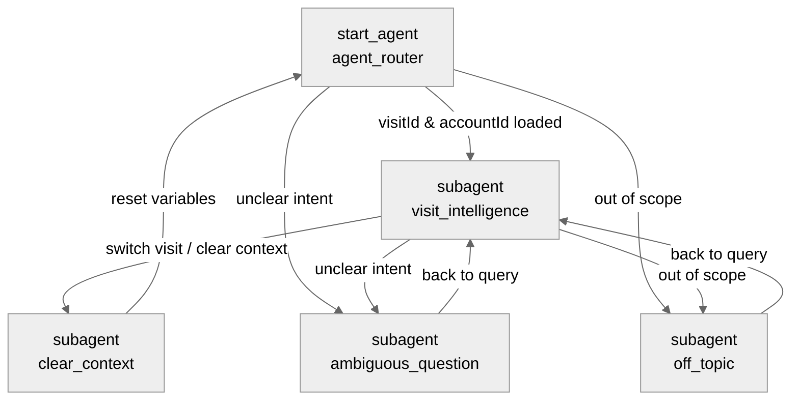

# Agent Spec: Visit_Intelligence

## Purpose & Scope

The `Visit_Intelligence` agent is designed to assist internal users (supervisors and field reps) in managing and analyzing **Visit** records and their associated **Account** context. It helps users search, select, and review visit details, view store briefs, generate visit summaries, analyze historical order metrics, recommend products, and perform updates to visits or order notes.

## Behavioral Intent

The agent's behavior is guided by the following key rules:
- **Context Initialization**: On startup, it reads the active page context (`currentRecordId` and `currentObjectApiName`). If the context represents a `Visit` record page, it automatically loads details and transitions to the main analysis agent.
- **Search & Selection**: If no page context exists, the user can search by text/date or retrieve a general list of visits. Once a visit is selected, its details (Account Name, Status, Date, Assigned User) are loaded.
- **Record Display Formatting**: 
  - Lists of visits (available visits, search results, account visit history, OOS visits) are presented as formal, numbered text lists starting at 1.
  - The visit name is rendered as a markdown hyperlink (e.g., `[00000370](/lightning/r/Visit/0Z5f6000000DWeqCAG/view)`) to redirect the user to the record page.
  - Bulleted sub-lists display key details (Account, Status, Date/Time, Owner).
  - Account details are displayed in a clean markdown table with emojis. Metrics and counts are displayed as bulleted lists, and lists of child records are displayed as markdown tables.
- **Numbered Selection & Handoff**: If the user inputs a number corresponding to a visit list item (e.g., "1", "2") or types the visit name (e.g. "00000370"), the agent automatically maps that input to the correct item, extracts its `recordId`, and calls `select_visit` to switch to that visit's context. If the user is already in the `visit_intelligence` subagent, they are transitioned to `clear_context` to reset before loading the new visit context.
- **Guardrails**: Includes standard off-topic and ambiguous question handling to maintain the conversation's scope.
- **Escalation**: Not applicable (this is an employee agent).

## Subagent Map

## Variables

- `currentRecordId` (mutable string = "") — Stores the record ID of the active page context.
- `currentObjectApiName` (mutable string = "") — Stores the object type of the active page context.
- `lastRecordId` (mutable string = "") — The ID of the last seen record page to detect page navigation.
- `visitId` (mutable string = "") — The ID of the currently selected Visit.
- `accountId` (mutable string = "") — The ID of the Account associated with the current Visit.
- `accountName` (mutable string = "") — The name of the associated Account.
- `visitStatus` (mutable string = "") — The status of the current Visit.
- `visitDate` (mutable string = "") — The planned date/time of the current Visit.
- `assignedUser` (mutable string = "") — The name of the user assigned to the current Visit.
- `visitSummaryText` (mutable string = "") — The automatically pre-loaded visit summary text.

## Actions & Backing Logic

### get_visit_details (agent_router / visit_intelligence)
- **Target**: `flow://Get_Visit_Details`
- **Backing Status**: EXISTS
- **Inputs**: 
  - `recordId` (string, required)
- **Outputs**:
  - `recordId` (string, visible: Yes)
  - `accountId` (string, visible: Yes)
  - `accountName` (string, visible: Yes)
  - `visitStatus` (string, visible: Yes)
  - `visitDate` (string, visible: Yes)
  - `assignedUser` (string, visible: Yes)

### get_available_visits (agent_router)
- **Target**: `apex://Visit_Agent_SObject_Service`
- **Backing Status**: EXISTS
- **Inputs**:
  - `actionType` (string, required) - Set to 'getAvailable'
  - `searchQuery` (string)
- **Outputs**:
  - `visitsList` (list[object], visible: Yes, type: `@apexClassType/c__Visit_Agent_SObject_Service$VisitInfo`, is_displayable: True)

### search_visits (agent_router)
- **Target**: `apex://Visit_Agent_SObject_Service`
- **Backing Status**: EXISTS
- **Inputs**:
  - `actionType` (string, required) - Set to 'search'
  - `searchQuery` (string, required)
- **Outputs**:
  - `visitsList` (list[object], visible: Yes, type: `@apexClassType/c__Visit_Agent_SObject_Service$VisitInfo`, is_displayable: True)

### get_account_visits (visit_intelligence)
- **Target**: `apex://Visit_Agent_SObject_Service`
- **Backing Status**: EXISTS
- **Inputs**:
  - `actionType` (string, required) - Set to 'getAccountVisits'
  - `accountId` (string, required)
  - `searchQuery` (string)
- **Outputs**:
  - `visitsList` (list[object], visible: Yes, type: `@apexClassType/c__Visit_Agent_SObject_Service$VisitInfo`, is_displayable: True)

### get_oos_visits (visit_intelligence)
- **Target**: `apex://Visit_Agent_SObject_Service`
- **Backing Status**: EXISTS
- **Inputs**:
  - `actionType` (string, required) - Set to 'getOosVisits'
  - `accountId` (string, required)
  - `searchQuery` (string)
- **Outputs**:
  - `visitsList` (list[object], visible: Yes, type: `@apexClassType/c__Visit_Agent_SObject_Service$VisitInfo`, is_displayable: True)

### get_related_counts (visit_intelligence)
- **Target**: `apex://Account_Agent_Handler`
- **Backing Status**: EXISTS

### get_related_records (visit_intelligence)
- **Target**: `apex://Account_Agent_Handler`
- **Backing Status**: EXISTS

### get_order_summary (visit_intelligence)
- **Target**: `apex://Order_Agent_Handler`
- **Backing Status**: EXISTS

### get_visit_orders (visit_intelligence)
- **Target**: `apex://Order_Agent_Handler`
- **Backing Status**: EXISTS

### get_order_items (visit_intelligence)
- **Target**: `apex://Order_Agent_Handler`
- **Backing Status**: EXISTS

### update_order_notes (visit_intelligence)
- **Target**: `apex://Order_Agent_Handler`
- **Backing Status**: EXISTS

### get_store_brief (visit_intelligence)
- **Target**: `apex://Visit_Agent_Handler`
- **Backing Status**: EXISTS

### suggest_products (visit_intelligence)
- **Target**: `apex://Account_Agent_Handler`
- **Backing Status**: EXISTS

### generate_visit_summary (visit_intelligence)
- **Target**: `apex://Visit_Agent_Handler`
- **Backing Status**: EXISTS

### update_visit (visit_intelligence)
- **Target**: `apex://Visit_Agent_Handler`
- **Backing Status**: EXISTS

### search_users (visit_intelligence)
- **Target**: `apex://User_Agent_Handler`
- **Backing Status**: EXISTS

## Gating Logic
No strict gating logic required beyond context checking on variables (`@variables.visitId` and `@variables.accountId`).

## Architecture Pattern
Hub-and-Spoke Pattern. The router `agent_router` acts as the entry point and routes the user to `visit_intelligence` once context variables are initialized.

## Agent Configuration
- **developer_name**: `Visit_Intelligence`
- **agent_label**: `Visit Intelligence`
- **agent_type**: `AgentforceEmployeeAgent`
- **default_agent_user**: N/A
