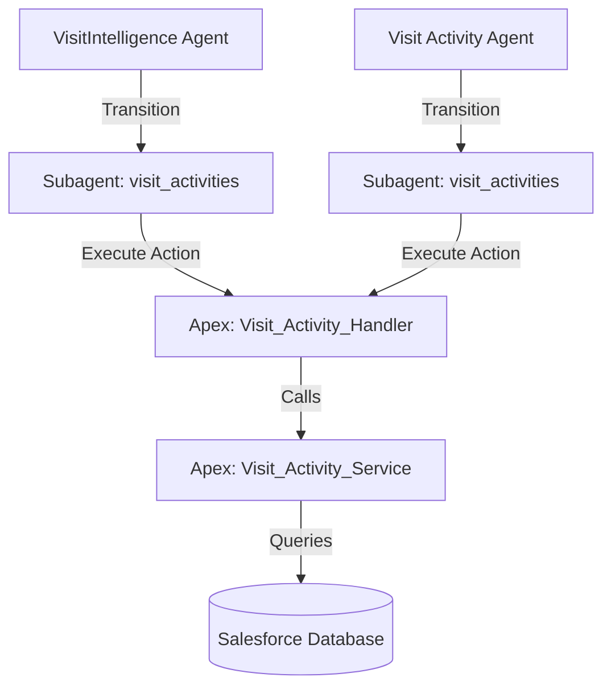
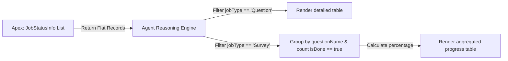

# 📊 Architectural Report: Visit Activity Subagents & Data Flow

This report outlines the structural configuration, database-fetching mechanism, and interlinkage of the Agentforce agents and subagents related to **Visit Activities, Checklists, and Surveys** in your CG Cloud Org.

---

## 1. How Many Agents/Subagents Exist?

There are **two main agent entry points** configured in your metadata:

### A. `VisitIntelligence` (Parent Agent)
* **Role:** The primary "cockpit" or general assistant for the representative. It handles full retail execution details, including Account Summary counts, Contacts list, Promotions auditing, Inventory/OOS checking, Order History summaries, and Status/Time updates.
* **Activities Subagent:** It contains a local subagent named `visit_activities`. When a user clicks option 9 (or option 6 in next steps) or types *"Visit Activities"*, the parent transitions control to this subagent.

### B. `Visit_Activity_Agent` (Standalone Agent)
* **Role:** A task-focused, lightweight workspace built specifically for representatives who only need to focus on completing checklists and surveys during a store visit.
* **Activities Subagent:** It contains its own local `visit_activities` subagent that manages the survey checklist questions, status checks, and question status listings.

---

## 2. Shared Invocable Actions & Database Fetching

Both the parent `VisitIntelligence` and the standalone `Visit_Activity_Agent` call the **exact same Apex backend controllers** to pull their records. There is no duplication of query logic.



### How Data is Pulled:
When the subagent triggers a query, it calls the Apex Invocable method `Visit_Activity_Handler.execute` with the active `visitId` stored in the agent session variable.

1. **`getVisitActivities` (Planned Checklists/Surveys):**
   * **Visit Status check:** Inspects if the visit has any active `cgcloud__Visit_Job__c` records.
   * **Smart Fallback:** If the visit is in `Planned` status (and has no instantiated jobs yet), it queries the setup-time configuration on the **Visit Template** (`cgcloud__Visit_Template__c`) and **Job Definition List** (JDL).
   * **Bypasses Instantiation Block:** This fallback prevents the agent from returning empty results before the visit is officially started.

2. **`getVisitJobsStatus` (Completed vs. Pending Tracking):**
   * Queries the database for `cgcloud__Visit_Job__c` records associated with the `visitId`.
   * Maps questions to their response state:
     * **Answered:** Job has a response value recorded.
     * **Pending:** Job has no response value.

---

## 3. How They Are Interlinked

While they are separate metadata configurations, they are interlinked through:

1. **Shared Back-End Logic:** Any enhancement made to `Visit_Activity_Service` (such as the Planned-visit fallback query or Question vs. Survey filters) immediately benefits both the standalone agent and the parent subagent.
2. **Context Pinning:** Both agents use `before_reasoning` instructions to set `activeSubagent = "visit_activities"`. This pins the user's session variables (`visitId`, `accountId`, `accountName`) so that the AI reasoning engine preserves the active store and visit context across multiple chat turns.
3. **Execution Modes:** 
   * **VisitIntelligence** is best when the user needs to jump between tasks (e.g. check inventory first, then do activities, then capture an order).
   * **Visit_Activity_Agent** is ideal for deep-diving into surveys without any extra dashboard noise.

---

## 4. Differentiated Jobs & Surveys Status Aggregation Architecture

To prevent display clutter when there are many products per survey (e.g., 100 products for 4 surveys would result in a massive 400-row table), the agent differentiates the status formatting:

1. **Questions Status:** Rendered as detailed rows showing each question's individual status (suitable for low-volume visit questions).
2. **Surveys Status:** Aggregated in-memory by the Agent reasoning engine to summarize progress as product-check completion ratios.

### Logic & Data Transformation Flow:



### Mock Data Representation:

#### A. Input (Flat List returned by Apex):
```json
[
  {
    "questionName": "Coupons available",
    "questionDescription": "Are coupons placed?",
    "isDone": true,
    "jobType": "Survey",
    "productName": "Empower Lemon 1.5L"
  },
  {
    "questionName": "Coupons available",
    "questionDescription": "Are coupons placed?",
    "isDone": false,
    "jobType": "Survey",
    "productName": "Flash Orange 0.5L"
  },
  {
    "questionName": "Display refilled",
    "questionDescription": "Is display stocked?",
    "isDone": true,
    "jobType": "Survey",
    "productName": "Empower Lemon 1.5L"
  },
  {
    "questionName": "Display refilled",
    "questionDescription": "Is display stocked?",
    "isDone": true,
    "jobType": "Survey",
    "productName": "Flash Orange 0.5L"
  }
]
```

#### B. In-Memory Aggregation logic:
* **For `Coupons available`:**
  * Total matched records: `2`
  * Records with `isDone == true`: `1`
  * Progress: `1 / 2` (50%)
* **For `Display refilled`:**
  * Total matched records: `2`
  * Records with `isDone == true`: `2`
  * Progress: `2 / 2` (100% Complete)

#### C. Output (Rendered Markdown inside Chat UI):

##### 📋 Surveys Status

| 📝 Survey | 📦 Products Checked / Total | 📊 Progress |
| :--- | :--- | :--- |
| Coupons available | 1 / 2 | 50% |
| Display refilled | 2 / 2 | 100% ✅ |

