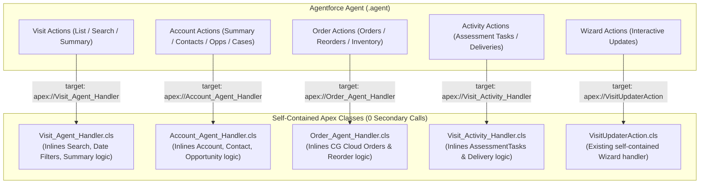
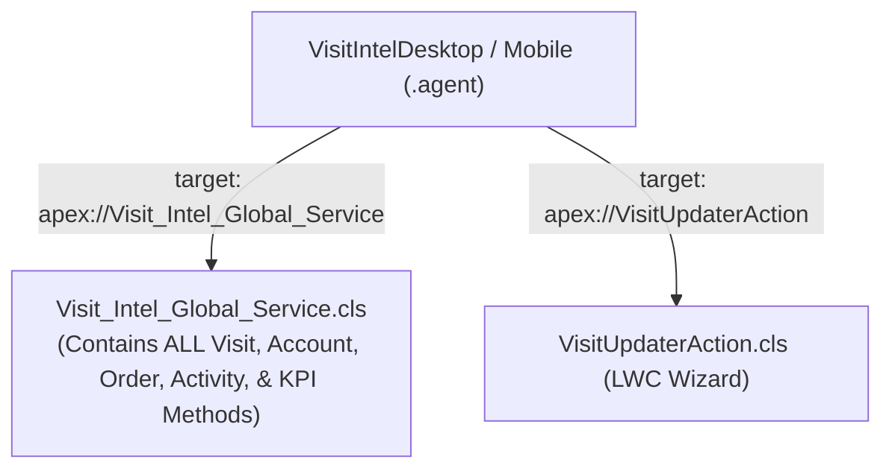
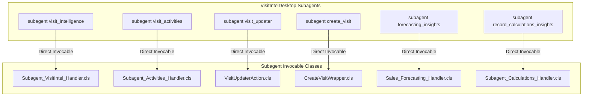

# 🏗️ Visit Intelligence 2GP Architecture Refactoring Proposals

## 📋 Executive Summary & Technical Problem Statement
In Salesforce **2nd Generation Managed Packages (2GP)**, Agentforce Atlas runtime encounters severe execution errors (`500 Internal Server Error` / `ClassNotFoundException`) when:
1. **Dynamic Reflection (`Type.forName()`)**: Router classes attempt to dynamically instantiate service classes using string reflection across package namespace boundaries.
2. **Multi-Tier Class Chaining**: An Invocable class called by the Agent delegates to secondary and tertiary helper classes (`Agent -> Class A -> Class B -> Class C`), where execution context or permission scope is lost.
3. **Nested Inner Class Serialization**: Invocable actions output nested Apex Inner Classes (`OuterClass$InnerClass` DTOs), which fail cross-namespace deserialization in the Agentforce Atlas gateway.

### The Fundamental Rule for 2GP Stability:
> **Every action invoked by the Agent must execute through direct compile-time bindings with 0 broken class hops, returning flat primitive data types (`String`, `Boolean`, `Integer`, `Decimal`) or top-level DTO classes.**

---

## 📊 Comprehensive Comparison Matrix

| Criteria | Option 1: Domain Handlers | Option 2: Unified Mega-Service | Option 3: Subagent Handlers | Option 4: Flow as Bridge (User Idea) |
| :--- | :---: | :---: | :---: | :---: |
| **Architectural Model** | Code-First Domain Handlers | Code-First 1-Class Consolidation | Agent-Centric Subagent Handlers | Declarative Orchestrator + Apex |
| **2GP Package Safety** | ⭐⭐⭐⭐⭐ 100% Safe | ⭐⭐⭐⭐⭐ 100% Safe | ⭐⭐⭐⭐⭐ 100% Safe | ⭐⭐⭐⭐⭐ 100% Safe |
| **Apex Class Count** | ~5–6 Classes | 2–3 Classes | ~5–6 Classes | ~4–6 Classes |
| **Flow Count** | 1 Flow | 1 Flow | 1 Flow | 4–6 Flows |
| **Execution Flow** | `Agent -> Domain Handler` | `Agent -> Global Service` | `Agent -> Subagent Handler` | `Agent -> Flow -> Invocable Class` |
| **Modularity** | High (Domain separated) | Low (All in 1 file) | High (Subagent separated) | Very High (Hybrid declarative) |
| **Maintainability** | ⭐⭐⭐⭐⭐ Clean & structured | ⭐⭐⭐⭐ Simple packaging | ⭐⭐⭐⭐⭐ Agent aligned | ⭐⭐⭐⭐⭐ Admin + Dev friendly |
| **Implementation Effort** | ~30–45 mins | ~30 mins | ~30–45 mins | ~45–60 mins |
| **Overall Score** | **9.5 / 10** | **9.0 / 10** | **9.2 / 10** | **8.5 / 10** |

---

## 🌟 Option 1: One Self-Contained Handler per Domain *(Code-First Recommended)*

### Architectural Concept
Decompose the 50 helper classes into **5 self-contained, domain-specific Invocable classes**. Each class contains all its own SOQL queries, algorithms, and private static helper methods directly in the same file with **zero external helper class dependencies**.



### Class Responsibilities:
1. **`Visit_Agent_Handler.cls`**:
   - Inlines `Visit_Summary_Helper`, `Visit_Search_Helper`, `Visit_Action_Helper`, `Visit_Lookup_Helper`.
   - Handles: `list_visits`, `find_visits`, `get_visit_details`, `get_visit_summary`, `select_visit`.
2. **`Account_Agent_Handler.cls`**:
   - Inlines `Account_Related_Records_Helper`.
   - Handles: `get_account_details`, `get_account_contacts`, `get_account_opportunities`, `get_account_cases`, `get_account_visits`.
3. **`Order_Agent_Handler.cls`**:
   - Inlines `Order_Recommendation_Service`.
   - Handles: `get_orders`, `get_order_details`, `get_order_recommendations`, `get_inventory_checks`.
4. **`Visit_Activity_Handler.cls`**:
   - Inlines `Visit_Activity_Service`.
   - Handles: `get_assessment_tasks`, `get_delivery_activities`.
5. **`Sales_Forecasting_Handler.cls`**:
   - Existing self-contained forecasting engine.
6. **`VisitUpdaterAction.cls`**:
   - Existing self-contained LWC wizard update engine.

### Pros:
- **Zero Class Chaining**: Every domain handler is 100% self-contained.
- **Clean Separation of Concerns**: Editing Order logic cannot introduce bugs in Visit queries.
- **Standard Agentforce Pattern**: Actions in `.agent` directly reference their dedicated domain target.

---

## 🌟 Option 2: Single Unified Mega-Service *(The 1-Class Architecture)*

### Architectural Concept
Merge all text-based intelligence actions across Visits, Accounts, Orders, Activities, and Calculations into **1 single consolidated Apex service class**, replicating the exact single-class pattern proven with `TST_AccountIntel_Agent`.



### Class Responsibilities:
1. **`Visit_Intel_Global_Service.cls`**:
   - Single `@InvocableMethod` dispatcher with `actionType` parameter.
   - Embeds private static methods: `handleVisitSummary`, `handleSearchVisits`, `handleAccountDetails`, `handleContacts`, `handleOrders`, `handleAssessmentTasks`.
   - Flat primitive Markdown outputs (`summary: String`, `googleMapsUrl: String`, `success: Boolean`, `message: String`).
2. **`VisitUpdaterAction.cls` & `CreateVisitWrapper.cls`**:
   - Retained for interactive LWC form wizards.

### Pros:
- **Minimal Metadata**: Reduces the entire Apex backend to just 2–3 files.
- **Zero Inter-Class Risk**: There are no other classes to fail or misconfigure.
- **Simplest 2GP Packaging**: Fast build and verification times.

### Cons:
- Large single file (~1,500–2,000 lines of Apex code).

---

## 🌟 Option 3: Subagent-Dedicated Invocables *(Agentforce Subagent Alignment)*

### Architectural Concept
Align Apex architecture directly with the Agentforce Agent Script structure by creating **exactly 1 self-contained Invocable class for each Subagent** defined in `VisitIntelDesktop.agent`:



### Pros:
- **1:1 Subagent Mirroring**: Developers know exactly which Apex class backs each subagent in Agent Builder.
- **Independent Lifecycles**: Subagent actions can be updated or tested in complete isolation.

---

## 🌟 Option 4 (User Idea): Autolaunched Flow as Orchestrator / Bridge

### Architectural Concept
Use **Salesforce Autolaunched Flows** as the middle tier / API gateway between Agentforce and backend Apex actions.

```mermaid
graph TD
    Agent["Agentforce Agent (.agent)"] -->|target: flow://Get_Account_Intel| Flow["Autolaunched Flow (Bridge / Orchestrator)"]
    Flow -->|Native Get Records| DB[("Salesforce Database")]
    Flow -->|Flow Apex Action| Invocable1["Invocable Math / KPI Calculator"]
    Flow -->|Flow Apex Action| Invocable2["Invocable Fuzzy Matcher"]
    Flow -->|Returns flat primitives (String, Boolean)| Agent
```

### How it works:
1. Agentforce Agent Script calls the Flow directly via `target: "flow://<FlowName>"`.
2. The Flow orchestrates the request:
   - Uses standard `Get Records` elements for straightforward record retrieval (e.g. Account details, Visit headers).
   - Calls dedicated, focused Invocable Apex actions for heavy computation, complex SOQL filters, or algorithms.
3. The Flow maps results to output variables (`outputSummary`, `googleMapsUrl`, `isSuccess`) and returns them to the Agent.

### Detailed Rating & Analysis:
* **Rating**: **8.5 / 10 (Strong, Resilient, & Salesforce-Native)**
* **Why it works in 2GP**: Flow-to-Apex invocations (`Flow -> Invocable Apex`) execute inside the core Salesforce Workflow engine, bypassing the external Agentforce Atlas Java reflection bridge completely.
* **Fault Handling**: Flows support visual Fault Connectors (`On Fault -> Set Error -> Return Gracefully`), preventing 500 runtime crashes from reaching the user.
* **Consideration**: Requires creating and maintaining 4–6 Autolaunched Flow metadata files in source control alongside Apex classes.

---

## 🚀 Recommended Implementation Next Steps

1. **Select Preferred Approach**: Choose between **Option 1 (Domain Handlers)**, **Option 2 (Single Mega-Service)**, **Option 3 (Subagent Handlers)**, or **Option 4 (Flow Bridge)**.
2. **Execute Consolidation**: Replace the multi-tier helper classes with the selected architecture.
3. **Verify Locally & on Dev Hub**: Deploy classes and run unit tests to guarantee 100% test pass rate and high code coverage.
4. **Build 2GP Managed Package**: Package the clean metadata version with `--skip-validation` and install in the target sandbox to verify runtime execution.
