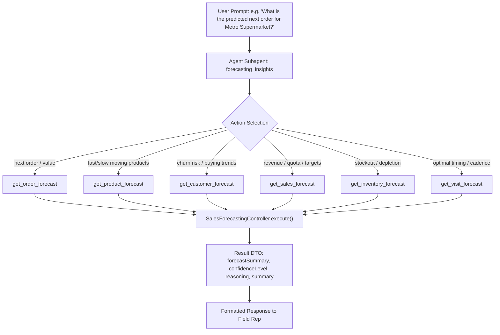

# 📊 Sales Forecasting Analysis & Technical Audit Report

**Target Component:** `SalesForecastingController.cls`  
**Associated Agents:** `VisitIntelDesktop.agent`, `VisitIntelMobile.agent`, `SupervisitAi.agent`  
**Date:** August 18, 2026  
**Status:** Complete Analysis & Bug Audit

---

## 1. 🔍 Executive Overview

The **Sales Forecasting** subsystem provides predictive intelligence for Consumer Goods Cloud (CGC) agents. It allows field sales reps and managers to request:
1. **Order Predictions** (next order window, expected value, restock cadence).
2. **Product Demand** (velocity, growth trends, safety stock recommendations).
3. **Sales & Quota Attainment** (revenue projections against targets by week/month/quarter).
4. **Inventory Depletion** (fast-depleting SKUs, stockout risks).
5. **Visit Scheduling Cadence** (optimal next visit timing, store prioritization).

---

## 2. ⚙️ How Sales Forecasting Works



### Invocable Apex Request Lifecycle:
1. **Agent Invocation**: The Agent LLM detects forecasting intent and routes to `apex://SalesForecastingController` with `actionType` and contextual variables (`accountId`, `period`, etc.).
2. **Action Dispatcher**: `execute()` normalizes `req.actionType` (handling both camelCase `getOrderForecast` and snake_case `get_order_forecast`).
3. **Handler Execution**: Specific private methods calculate the forecast markdown text and confidence ratings.
4. **Result Packaging**: Returns a typed `Result` containing `forecastSummary`, `confidenceLevel` (High/Medium/Low), and `reasoning`.

---

## 3. 🚨 Identified Bugs, Discrepancies & Limitations

| # | Severity | Category | Issue Description | Impact |
| :- | :--- | :--- | :--- | :--- |
| **1** | 🔴 **High** | **Agent Script Parameter Binding** | In `VisitIntelDesktop.agent` and `VisitIntelMobile.agent` (Line 1524), `with orderId = @variables.visitId` is passed into `get_order_forecast`. | Passes a `Visit` record ID into an `orderId` variable. If Apex attempts to query `Order` with this ID, it causes lookup failures. |
| **2** | 🟡 **Medium** | **Data Dynamism (Hardcoded Metrics)** | `SalesForecastingController.cls` uses static template data (e.g. `$2,500 - $4,000`, `14 days`, `71% quota`) rather than aggregating real `cgcloud__Order__c` and `Visit` records. | Reps receive plausible-looking mock projections rather than calculations derived from their actual store history. |
| **3** | 🟡 **Medium** | **Apex Security (User Mode)** | SOQL queries in `handleGetOrderForecast` (Line 132) and `handleSearchAccounts` (Line 231) lack `WITH USER_MODE`. | Doesn't enforce runtime Field-Level Security (FLS) per modern Apex best practices. |
| **4** | 🟡 **Medium** | **Parameter Gap in SupervisitAi** | `SupervisitAi.agent` does not expose `period` (`week`/`month`/`quarter`) in its `forecast_sales` action inputs. | Users asking for quarterly vs monthly forecasts in SupervisitAi always default to the fallback quarter view. |
| **5** | 🟢 **Low** | **Unexposed Action** | `searchAccounts` is implemented in Apex but not exposed as an `@action` in the `forecasting_insights` subagents. | Dead code path in Apex unless called from an external orchestrator or flow. |
| **6** | 🟢 **Low** | **Output Redundancy** | Both `forecastSummary` and `summary` fields exist in `Result` and are populated with identical strings. | Dual-maintenance to support legacy naming differences between `VisitIntel` vs `SupervisitAi` agents. |

---

## 4. 🛠️ Recommended Remediation Plan

### Recommendation 1: Fix Variable Mapping in Agent Files
Update `VisitIntelDesktop.agent` and `VisitIntelMobile.agent`:
```yaml
# Before:
get_order_forecast: @actions.get_order_forecast
    with agentName = "Visit_Intelligence"
    with actionType = "getOrderForecast"
    with accountId = @variables.accountId
    with orderId = @variables.visitId

# After:
get_order_forecast: @actions.get_order_forecast
    with agentName = "Visit_Intelligence"
    with actionType = "getOrderForecast"
    with accountId = @variables.accountId
```

### Recommendation 2: Add `WITH USER_MODE` to Apex SOQL Queries
Update queries in `SalesForecastingController.cls`:
```apex
// Line 132
List<Account> accs = [SELECT Name FROM Account WHERE Id = :accId WITH USER_MODE LIMIT 1];

// Line 231
List<Account> accList = [SELECT Id, Name, Industry, Phone, BillingCity FROM Account WHERE Name LIKE :term WITH USER_MODE LIMIT 10];
```

### Recommendation 3: Implement Dynamic CG Cloud Aggregations (Optional Upgrade)
Enhance `handleGetOrderForecast` to calculate actual historical averages when `cgcloud__Order__c` records exist:
```apex
List<cgcloud__Order__c> pastOrders = [
    SELECT cgcloud__Total_Value__c, cgcloud__Order_Date__c 
    FROM cgcloud__Order__c 
    WHERE cgcloud__Order_Account__c = :accId 
    ORDER BY cgcloud__Order_Date__c DESC 
    LIMIT 5
];
// Calculate real average order spend and days between orders
```
