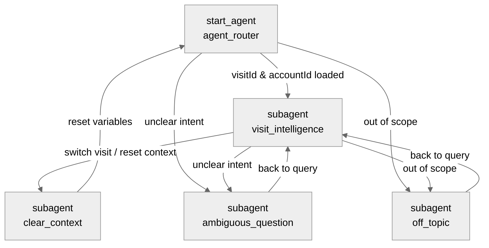

# Visit Intelligence Agent - Status, Architecture, and Features Spec

This document provides a comprehensive analysis of the `VisitIntelligence` agent, detailing its compilation/validation status, high-level architecture, subagent execution graph, backing logic components, and key features.

---

## 1. Executive Summary

The `VisitIntelligence` agent is an AI-powered helper built for Salesforce Consumer Goods Cloud (CGC) to assist internal users—specifically field representatives and sales supervisors—with Visit record execution and Account-level intelligence. It resides as an `AiAuthoringBundle` in the local SFDX project directory and maps user prompts to Salesforce Flows and Apex logic.

---

## 2. Current Status

- **Agent Name (Developer Name):** `VisitIntelligence`
- **Agent Label:** `Visit Intelligence`
- **Agent Type:** `AgentforceEmployeeAgent` (Employee Agent)
- **Local Path:** `force-app/main/default/aiAuthoringBundles/VisitIntelligence/`
- **Validation Status:**  
  Running the Salesforce CLI agent validator succeeds:
  ```json
  {
    "status": 0,
    "result": {
      "success": true
    },
    "warnings": []
  }
  ```
- **Reasoning Engine Config:**
  - **Planner Type:** `Atlas__ConcurrentMultiAgentOrchestration` (Concurrent Multi-Agent Orchestration)
  - **AI Model:** Anthropic Claude 4.5 Sonnet (`model://sfdc_ai__DefaultBedrockAnthropicClaude45Sonnet`)
  - **Supported Language Locales:** `en_US`

---

## 3. System Architecture & Control Flow

### 3.1 Subagent Map

The agent utilizes a **Hub-and-Spoke** architecture pattern with 5 subagents/topics:



### 3.2 State Variables

The agent maintains conversational state using the following context variables:

| Variable | Type | Description | Visibility |
| :--- | :--- | :--- | :--- |
| `currentRecordId` | `mutable string` | The record ID of the active page context. | External |
| `currentObjectApiName` | `mutable string` | The API name of the active page object. | External |
| `lastRecordId` | `mutable string` | Tracks page navigation to trigger context resets. | Internal |
| `visitId` | `mutable string` | The ID of the currently selected Visit. | Internal |
| `accountId` | `mutable string` | The ID of the Account associated with the current Visit. | Internal |
| `accountName` | `mutable string` | The associated Account Name. | Internal |
| `visitStatus` | `mutable string` | Status of the active Visit. | Internal |
| `visitDate` | `mutable string` | Scheduled date/time of the Visit. | Internal |
| `assignedUser` | `mutable string` | Owner/Assignee of the Visit. | Internal |
| `visitSummaryText` | `mutable string` | Automatically pre-loaded visit execution summary. | Internal |

---

## 4. Backing Action & Handler Mappings

The backend logic uses a decoupled **Dispatcher-Service** pattern. Because Salesforce Agentforce Apex actions are limited to a single `@InvocableMethod` per class, we use a single entry point class per functional area (**Handler**) and dispatch calls to target **Services** based on the static `actionType` parameter passed by the agent script.

### 4.1 Detail Action Map

| Agent Action API | Target Type | Invocation Target | Dispatched Service Class / Logic | Description |
| :--- | :--- | :--- | :--- | :--- |
| `get_visit_details` | `flow` | `Get_Visit_Details` | Salesforce Flow | Retrieves details of the current Visit and its Account context. |
| `get_available_visits`| `apex` | `Visit_Agent_Handler` | `Visit_Intelligence_Service2.getAvailableVisits()` | Retrieves recently viewed, owned, and scheduled visits. |
| `search_visits` | `apex` | `Visit_Agent_Handler` | `Visit_Intelligence_Service2.searchVisits(...)` | Searches Visit records by Account/store name or date. |
| `get_related_counts` | `apex` | `Account_Agent_Handler` | `Visit_Intelligence_Service.getCounts(...)` | Gets counts of Contacts, Tasks, Promotions, OOS, Assortments. |
| `get_related_records`| `apex` | `Account_Agent_Handler` | `Visit_Intelligence_Service.getRecords(...)` | Returns lists of related records (e.g. Contacts, Promotions). |
| `get_account_visits` | `apex` | `Visit_Agent_SObject_Service`| Directly queries database | Retrieves Visit records for the active Account. |
| `get_oos_visits` | `apex` | `Visit_Agent_SObject_Service`| Directly queries database | Retrieves Visit records with Out-Of-Stock issues. |
| `get_order_summary` | `apex` | `Order_Agent_Handler` | `Visit_Intelligence_Service.getAccountSummary(...)`| Gets historical order summary & buying insights. |
| `get_visit_orders` | `apex` | `Order_Agent_Handler` | `Visit_Intelligence_Service.getVisitSummary(...)`| Gets order summary associated specifically with `visitId`. |
| `get_order_items` | `apex` | `Order_Agent_Handler` | `Visit_Intelligence_Service.getLineItems(...)`| Returns product line items for a specific Order. |
| `update_order_notes` | `apex` | `Order_Agent_Handler` | `Visit_Intelligence_Service.updateNotes(...)`| Updates delivery and invoice notes on an order. |
| `get_store_brief` | `apex` | `Visit_Agent_Handler` | `Visit_Intelligence_Service2.getStoreBrief(...)` | Generates a consolidated store briefing and audit summary. |
| `suggest_products` | `apex` | `Account_Agent_Handler` | `Visit_Intelligence_Service.suggestProducts(...)` | Analyzes catalog gaps and suggests items to order. |
| `generate_visit_summary`| `apex` | `Visit_Agent_Handler`| `Visit_Intelligence_Service2.generateSummary(...)`| Generates a structured visit summary report. |
| `update_visit` | `apex` | `Visit_Agent_Handler` | `Visit_Intelligence_Service2.updateVisit(...)` | Generic update method for Visit records. |
| `update_visit_status` | `apex` | `Update_Visit_Status_Action`| Directly updates status | Triggers status selection UI form in the client. |
| `update_visit_owner` | `apex` | `Update_Visit_Owner_Action`| Directly updates owner | Triggers assignee search and updates visit owner. |
| `update_visit_notes` | `apex` | `Update_Visit_Notes_Action`| Directly updates notes | Appends representative notes to the Visit record. |
| `update_visit_start_time`| `apex` | `Update_Visit_StartTime_Action`| Directly updates start time | Updates planned start datetime (renders picker). |
| `update_visit_end_time` | `apex` | `Update_Visit_EndTime_Action`| Directly updates end time | Updates planned end datetime (renders picker). |
| `search_users` | `apex` | `User_Agent_Handler` | `Visit_Intelligence_Service2.searchUsers(...)` | Searches for users by name. |

---

## 5. Key Features & Capabilities

### 5.1 Context Page Detection & Auto-Routing
When loaded from a **Visit** record page, the agent extracts `currentRecordId` and checks if it is new. It automatically calls `get_visit_details` to initialize the context and immediately transitions to `visit_intelligence` to present the store overview.

### 5.2 Visit Search & Dynamic Selection
- **List / Search / Today's Visits:** Lists recent/owned visits, searches by name/date, or lists today's schedule. Results are presented as a formal numbered list where each visit name is a markdown hyperlink pointing to the record.
- **Smart Selection:** Users can type a list index (e.g., "1") or visit number (e.g., "00000370"). The agent dynamically maps this input to extract the record ID and loads the visit context.

### 5.3 Consolidated Store Briefing
Retrieves historical spends, active promotions, and open tasks to format a clean markdown card summarizing the store status.

### 5.4 Order History, Insights, and Recommendations
- Summarizes orders, spend, and phases in a markdown table.
- Suggests new products to order based on gaps in assortments and purchase history.
- Retrieves order item line-ups with SKU and quantities.

### 5.5 Slot-Filling Interactive UI Forms
For record update operations (Status, Owner, Notes, Start/End times), the agent calls dedicated actions designed with `is_user_input: True` variables. Instead of prompting for values in text, the agent calls the action with just the `visitId` to let the Salesforce UI handle input via native forms (picklists, calendar pickers, search dialogs).

---

## 6. Execution Command Reference

Use these Salesforce CLI (`sf`) commands to validate, deploy, and manage the `VisitIntelligence` agent:

### 6.1 Agent Validation
Validates the local Agent Script file structure and targets against the Salesforce Org metadata:
```bash
sf agent validate authoring-bundle --json --api-name VisitIntelligence
```

### 6.2 Metadata Deployment
Deploys the local `VisitIntelligence` aiAuthoringBundle metadata to the Salesforce Org:
```bash
sf project deploy start --json --metadata AiAuthoringBundle:VisitIntelligence
```

### 6.3 Agent Publishing
Commits changes and builds a permanent version of the authoring bundle in the target Org:
```bash
sf agent publish authoring-bundle --json --api-name VisitIntelligence
```

### 6.4 Agent Activation
Activates the published version of the agent to make it live for internal users:
```bash
sf agent activate --json --api-name VisitIntelligence
```
