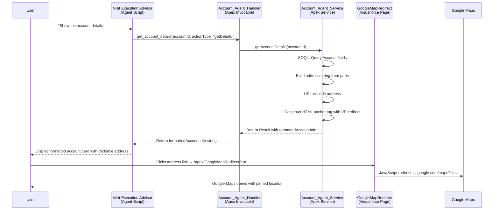

# Google Maps URL from Shipping Address — Full Logic Report

## Overview

When a user asks the **Visit Execution Advisor** agent for account details (e.g. *"Show me the store info"* or *"What's the account address?"*), the agent returns a formatted response that includes a **clickable Google Maps hyperlink** built dynamically from the Account's Shipping Address fields. This report traces the entire execution flow across 4 files.

---

## Architecture Diagram



---

## Step-by-Step Flow

### Step 1: User Asks a Question

The user sends a message like *"Show me the account details"* or *"What's the store address?"* to the agent in the Agentforce chat panel.

---

### Step 2: Agent Script Routes to the Action

In [Visit_Execution_Advisor.agent](file:///c:/Users/Siri%20Nagapur/test/gitsync2/CGCLOUD/force-app/main/default/aiAuthoringBundles/Visit_Execution_Advisor/Visit_Execution_Advisor.agent#L296-L303), the `visit_intelligence` subagent maps the user's intent to the `get_account_info` action:

```yaml
get_account_info: @actions.get_account_details
    description: "Get the active Account's contact and location details..."
    with agentName = "Visit_Execution_Advisor"
    with actionType = "getDetails"
    with accountId = @variables.accountId
```

This triggers the Apex invocable action `apex://Account_Agent_Handler` with:
| Parameter | Value |
|-----------|-------|
| `agentName` | `"Visit_Execution_Advisor"` |
| `actionType` | `"getDetails"` |
| `accountId` | The current Account ID from agent variables |

---

### Step 3: Handler Dispatches to Service Method

In [Account_Agent_Handler.cls](file:///c:/Users/Siri%20Nagapur/test/gitsync2/CGCLOUD/force-app/main/default/classes/Account_Agent_Handler.cls#L120-L140), the `@InvocableMethod` routes based on `actionType`:

```java
// Line 126
if (action == 'getdetails') {
    res = Account_Agent_Service.getAccountDetails(req.accountId);
}
```

---

### Step 4: Service Queries the Account Record

In [Account_Agent_Service.cls](file:///c:/Users/Siri%20Nagapur/test/gitsync2/CGCLOUD/force-app/main/default/classes/Account_Agent_Service.cls#L5-L125), the `getAccountDetails` method runs a SOQL query to fetch the Account's address fields:

```java
// Lines 13-21
List<Account> accs = [
    SELECT Id, Name, Phone, cgcloud__Account_Email__c, 
           ShippingStreet, ShippingCity, ShippingState,
           ShippingPostalCode, ShippingCountry,
           OperatingHoursId, OperatingHours.Name,
           OperatingHours.TimeZone 
    FROM Account 
    WHERE Id = :accId 
    WITH USER_MODE 
    LIMIT 1
];
```

The query fetches these 5 address fields from the `Account` object:

| Field API Name | Description | Example Value |
|----------------|-------------|---------------|
| `ShippingStreet` | Street address line | `"1-8-303, Chikkadpally"` |
| `ShippingCity` | City | `"Hyderabad"` |
| `ShippingState` | State/Province | `"Telangana"` |
| `ShippingPostalCode` | ZIP/Postal code | `"500020"` |
| `ShippingCountry` | Country | `"India"` |

---

### Step 5: Address String Assembly

The service class assembles the address parts into a single comma-separated string:

```java
// Lines 30-48 — Build address parts list
List<String> addrParts = new List<String>();

if (String.isNotBlank(acc.ShippingStreet)) {
    addrParts.add(acc.ShippingStreet);               // "1-8-303, Chikkadpally"
}

String cityStateZip = '';
if (String.isNotBlank(acc.ShippingCity)) {
    cityStateZip += acc.ShippingCity;                 // "Hyderabad"
}
if (String.isNotBlank(acc.ShippingState)) {
    cityStateZip += ', ' + acc.ShippingState;         // "Hyderabad, Telangana"
}
if (String.isNotBlank(acc.ShippingPostalCode)) {
    cityStateZip += ' ' + acc.ShippingPostalCode;     // "Hyderabad, Telangana 500020"
}
if (String.isNotBlank(cityStateZip)) {
    addrParts.add(cityStateZip);
}

if (String.isNotBlank(acc.ShippingCountry)) {
    addrParts.add(acc.ShippingCountry);               // "India"
}
```

**Result**: `addrParts` = `["1-8-303, Chikkadpally", "Hyderabad, Telangana 500020", "India"]`

The raw address string is then joined:

```java
// Line 87
String cleanAddress = String.join(addrParts, ', ');
// → "1-8-303, Chikkadpally, Hyderabad, Telangana 500020, India"
```

---

### Step 6: Google Maps URL Construction (Two URLs)

The service builds **two** Google Maps URLs for different purposes:

#### 6a. Direct URL (stored in `googleMapsUrl` field)

```java
// Line 63-64
String rawAddress = String.join(addrParts, ', ');
res.googleMapsUrl = 'https://maps.google.com/maps?q='
    + EncodingUtil.urlEncode(rawAddress, 'UTF-8');
```

**Result**:
```
https://maps.google.com/maps?q=1-8-303%2C+Chikkadpally%2C+Hyderabad%2C+Telangana+500020%2C+India
```

#### 6b. Visualforce Redirect URL (used in the formatted HTML output)

```java
// Lines 108-113
String query = EncodingUtil.urlEncode(cleanAddress, 'UTF-8');
addressLink = '<a href="/apex/GoogleMapRedirect?q=' + query
    + '" target="_blank">' + cleanAddress + '</a>';
```

**Result**:
```html
<a href="/apex/GoogleMapRedirect?q=1-8-303%2C+Chikkadpally%2C+Hyderabad%2C+Telangana+500020%2C+India"
   target="_blank">1-8-303, Chikkadpally, Hyderabad, Telangana 500020, India</a>
```

> [!IMPORTANT]
> The clickable link in the agent's output uses the **Visualforce redirect approach** (option 6b), not the direct Google Maps URL. This is necessary because Salesforce Lightning's Content Security Policy (CSP) blocks direct navigation to external domains from within the Agentforce chat panel. The Visualforce page acts as a trusted intermediary.

---

### Step 7: Formatted Response Assembly

The complete `formattedAccountInfo` string is built as a single pre-formatted text block:

```java
// Lines 115-121
res.formattedAccountInfo = 'Account Information\n\n' +
    '• Account Name: ' + cleanName + '\n\n' +
    '• Phone: ' + phoneLink + '\n\n' +              // <a href="tel:...">
    '• Email: ' + cleanEmail + '\n\n' +
    '• Shipping Address: ' + addressLink + '\n\n' +  // <a href="/apex/GoogleMapRedirect?q=...">
    '• Operating Hours: ' + cleanHours + '\n\n' +
    '• Time Zone: ' + cleanZone;
```

This string is returned to the agent as the `formattedAccountInfo` output variable and displayed directly in the chat panel.

---

### Step 8: User Clicks the Address Link

When the user clicks the clickable address text in the chat panel, the browser navigates to:

```
/apex/GoogleMapRedirect?q=1-8-303%2C+Chikkadpally%2C+Hyderabad%2C+Telangana+500020%2C+India
```

---

### Step 9: Visualforce Page Performs the Redirect

The [GoogleMapRedirect.page](file:///c:/Users/Siri%20Nagapur/test/gitsync2/CGCLOUD/force-app/main/default/pages/GoogleMapRedirect.page) is a lightweight Visualforce page that:

1. Shows a loading spinner with *"Redirecting to Google Maps..."*
2. Extracts the `q` query parameter from the URL
3. Performs a JavaScript `window.location.replace()` to Google Maps

```html
<apex:page showHeader="false" sidebar="false" standardStylesheets="false">
    <!-- Spinner UI omitted for brevity -->
    <script>
        (function() {
            var params = new URLSearchParams(window.location.search);
            var q = params.get('q');
            if (q) {
                window.location.replace(
                    "https://www.google.com/maps?q=" + encodeURIComponent(q)
                );
            } else {
                document.body.innerHTML = "<div class='card'>No address query provided.</div>";
            }
        })();
    </script>
</apex:page>
```

> [!NOTE]
> The address is **double-encoded** for safety: once by `EncodingUtil.urlEncode()` in Apex (Step 6b), and once by `encodeURIComponent()` in JavaScript (Step 9). The JavaScript `encodeURIComponent` re-encodes the already-decoded `q` parameter value to ensure the final Google Maps URL is valid.

---

### Step 10: Google Maps Opens

The browser navigates to:
```
https://www.google.com/maps?q=1-8-303, Chikkadpally, Hyderabad, Telangana 500020, India
```

Google Maps renders the location pin for the address.

---

## Files Involved

| # | File | Type | Role |
|---|------|------|------|
| 1 | [Visit_Execution_Advisor.agent](file:///c:/Users/Siri%20Nagapur/test/gitsync2/CGCLOUD/force-app/main/default/aiAuthoringBundles/Visit_Execution_Advisor/Visit_Execution_Advisor.agent) | Agent Script | Routes user intent to `get_account_details` action |
| 2 | [Account_Agent_Handler.cls](file:///c:/Users/Siri%20Nagapur/test/gitsync2/CGCLOUD/force-app/main/default/classes/Account_Agent_Handler.cls) | Apex Invocable | Dispatches `getDetails` action type to service method |
| 3 | [Account_Agent_Service.cls](file:///c:/Users/Siri%20Nagapur/test/gitsync2/CGCLOUD/force-app/main/default/classes/Account_Agent_Service.cls) | Apex Service | Queries Account, assembles address, builds Google Maps URL |
| 4 | [GoogleMapRedirect.page](file:///c:/Users/Siri%20Nagapur/test/gitsync2/CGCLOUD/force-app/main/default/pages/GoogleMapRedirect.page) | Visualforce Page | Intermediary redirect page that navigates to Google Maps |

---

## Why a Visualforce Redirect Page?

> [!WARNING]
> Direct external links (e.g. `https://www.google.com/maps?q=...`) do **not** work as clickable hyperlinks inside the Salesforce Agentforce chat panel because:
> 1. **Content Security Policy (CSP)**: Lightning enforces strict CSP rules that block navigation to external domains from within iframes and chat widgets.
> 2. **Trusted Navigation**: Salesforce only allows navigation to trusted internal paths (e.g. `/apex/...`, `/lightning/...`).
>
> The `GoogleMapRedirect` Visualforce page solves this by acting as a **trusted Salesforce-hosted intermediary** that performs a client-side JavaScript redirect to the external Google Maps URL.
