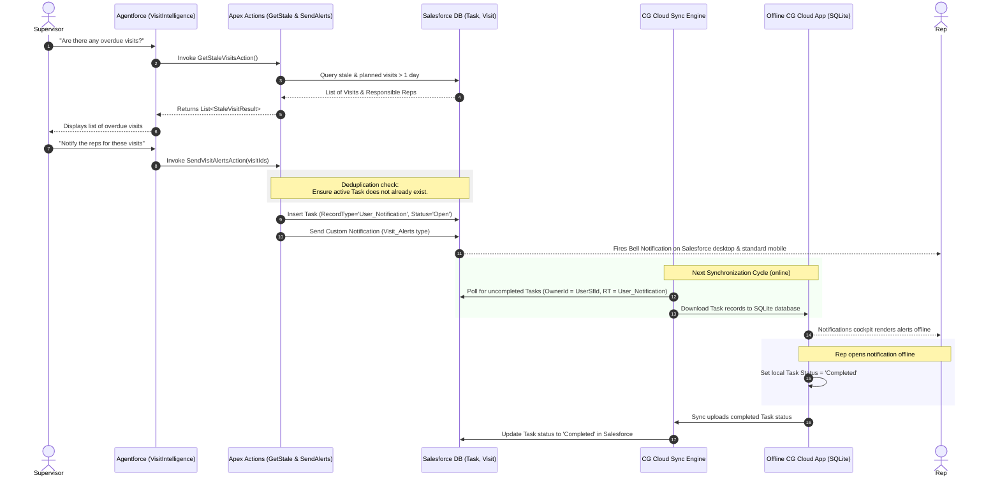

# Visit Alerts: Architecture & Implementation Guide

This document defines the end-to-end architecture and implementation details for the **Agentforce-Driven Visit Alerts** feature. It explains how supervisors can query overdue/stale visits and trigger notifications to responsible sales representatives across both the Salesforce Org (desktop and standard mobile app) and the offline-first Consumer Goods (CG) Cloud Mobile App.

---

## 1. Feature Overview

The feature addresses two specific visit conditions:
* **Overdue Planned Visits**: Visits in the `Planned` state that have not started for more than one day since their creation (`CreatedDate < Yesterday`).
* **Stale In-Progress Visits**: Visits in the `InProgress` state that have remained active for more than one day (`ActualVisitStartTime < Yesterday`).

Supervisors interact with the **Visit Intelligence** agent in Salesforce to:
1. Retrieve the list of visits matching these conditions.
2. Interactively execute the alert command, which notifies the reps responsible (`cgcloud__Responsible__c` or `OwnerId`).

---

## 2. System Architecture & Data Flow

This diagram illustrates the sequence of interactions between the Supervisor, Agentforce, the Salesforce Database, the Sync Engine, and the Offline Mobile App:



---

## 3. Salesforce Platform Implementation (Apex)

Two invocable Apex actions support the agent. These are bulk-safe and support user-mode execution.

### 3.1 `GetStaleVisitsAction.cls`
Retrieves the list of target visits. Accepts an optional `accountId` input to scope queries to a single account context.

```apex
public with sharing class GetStaleVisitsAction {
    
    public class Request {
        @InvocableVariable(description='Optional filter to get overdue or stale visits for a specific Account.')
        public String accountId;
    }
    
    public class StaleVisitResult {
        @InvocableVariable(description='The Visit Record ID.')
        public Id visitId;
        
        @InvocableVariable(description='The Visit Name.')
        public String visitName;
        
        @InvocableVariable(description='The Account Name.')
        public String accountName;
        
        @InvocableVariable(description='The Current Status of the Visit.')
        public String status;
        
        @InvocableVariable(description='The Name of the Responsible Rep.')
        public String responsibleRepName;
        
        @InvocableVariable(description='The ID of the Responsible Rep.')
        public Id responsibleRepId;
        
        @InvocableVariable(description='The Planned Start Time.')
        public DateTime plannedStartTime;
        
        @InvocableVariable(description='The Created Date of the Visit.')
        public DateTime createdDate;
    }
    
    @InvocableMethod(
        label='Get Overdue and Stale Visits'
        description='Retrieves all visits that have been Planned for more than one day since creation, or InProgress for more than one day, optionally filtered by Account.'
    )
    public static List<List<StaleVisitResult>> getVisits(List<Request> requests) {
        List<List<StaleVisitResult>> resultsList = new List<List<StaleVisitResult>>();
        DateTime yesterday = System.now().addDays(-1);
        
        for (Request req : requests) {
            List<StaleVisitResult> results = new List<StaleVisitResult>();
            
            String query = 'SELECT Id, Name, Status, CreatedDate, ActualVisitStartTime, PlannedVisitStartTime, ' +
                           'AccountId, Account.Name, cgcloud__Responsible__c, cgcloud__Responsible__r.Name, ' +
                           'OwnerId, Owner.Name ' +
                           'FROM Visit ' +
                           'WHERE ((Status = \'Planned\' AND CreatedDate < :yesterday) ' +
                           'OR (Status = \'InProgress\' AND (ActualVisitStartTime < :yesterday OR (ActualVisitStartTime = null AND LastModifiedDate < :yesterday))))';
            
            if (req != null && String.isNotBlank(req.accountId)) {
                query += ' AND AccountId = \'' + String.escapeSingleQuotes(req.accountId) + '\'';
            }
            
            query += ' WITH USER_MODE';
            
            List<Visit> visits = Database.query(query);
            
            for (Visit v : visits) {
                StaleVisitResult res = new StaleVisitResult();
                res.visitId = v.Id;
                res.visitName = v.Name;
                res.accountName = v.Account.Name;
                res.status = v.Status;
                res.responsibleRepId = v.cgcloud__Responsible__c != null ? v.cgcloud__Responsible__c : v.OwnerId;
                res.responsibleRepName = v.cgcloud__Responsible__c != null ? v.cgcloud__Responsible__r.Name : v.Owner.Name;
                res.plannedStartTime = v.PlannedVisitStartTime;
                res.createdDate = v.CreatedDate;
                results.add(res);
            }
            
            resultsList.add(results);
        }
        
        return resultsList;
    }
}
```

### 3.2 `SendVisitAlertsAction.cls`
Handles notification dispatch. Creates a standard `Task` record mapped for offline mobile synchronization, and issues standard Salesforce custom bell notifications.

```apex
public with sharing class SendVisitAlertsAction {
    
    public class Request {
        @InvocableVariable(required=true description='List of Visit record IDs to send notifications for.')
        public List<String> visitIds;
    }
    
    public class Result {
        @InvocableVariable(description='Indicates if the alerts were sent successfully.')
        public Boolean success;
        
        @InvocableVariable(description='Result status message.')
        public String message;
    }
    
    @InvocableMethod(
        label='Send Visit Alerts'
        description='Sends custom notifications (to desktop and mobile) and creates offline task notifications for the responsible reps of the specified visits.'
    )
    public static List<Result> sendAlerts(List<Request> requests) {
        List<Result> results = new List<Result>();
        
        // 1. Query Custom Notification Type ID
        Id notificationTypeId;
        try {
            CustomNotificationType notificationType = [
                SELECT Id 
                FROM CustomNotificationType 
                WHERE DeveloperName = 'Visit_Alerts' OR DeveloperName = 'VisitAlerts'
                LIMIT 1
            ];
            notificationTypeId = notificationType.Id;
        } catch (Exception e) {
            System.debug('Custom Notification Type "Visit Alerts" not found: ' + e.getMessage());
        }
        
        // 2. Query Task Record Type ID for 'User_Notification'
        Id taskRecordTypeId;
        try {
            RecordType rt = [
                SELECT Id 
                FROM RecordType 
                WHERE SObjectType = 'Task' AND DeveloperName = 'User_Notification'
                LIMIT 1
            ];
            taskRecordTypeId = rt.Id;
        } catch (Exception e) {
            System.debug('Task Record Type "User_Notification" not found: ' + e.getMessage());
        }
        
        for (Request req : requests) {
            Result res = new Result();
            res.success = false;
            
            if (req.visitIds == null || req.visitIds.isEmpty()) {
                res.message = 'No Visit IDs provided.';
                results.add(res);
                continue;
            }
            
            List<Visit> visits = [
                SELECT Id, Name, Status, cgcloud__Responsible__c, OwnerId, Account.Name
                FROM Visit
                WHERE Id IN :req.visitIds
                WITH USER_MODE
            ];
            
            if (visits.isEmpty()) {
                res.message = 'No matching Visit records found.';
                results.add(res);
                continue;
            }
            
            // Check for existing notification tasks to prevent duplicates
            Set<Id> visitsWithNotifications = new Set<Id>();
            if (taskRecordTypeId != null) {
                for (Task t : [
                    SELECT WhatId 
                    FROM Task 
                    WHERE WhatId IN :req.visitIds 
                      AND RecordTypeId = :taskRecordTypeId 
                      AND Status != 'Completed'
                ]) {
                    visitsWithNotifications.add(t.WhatId);
                }
            }
            
            List<Task> tasksToInsert = new List<Task>();
            Integer sentCount = 0;
            
            for (Visit v : visits) {
                if (visitsWithNotifications.contains(v.Id)) {
                    continue;
                }
                
                Id recipientId = v.cgcloud__Responsible__c != null ? v.cgcloud__Responsible__c : v.OwnerId;
                if (recipientId == null) {
                    continue;
                }
                
                String alertMessage = '';
                if (v.Status == 'Planned') {
                    alertMessage = 'Visit ' + v.Name + ' for store ' + v.Account.Name + ' has been in Planned state for more than one day from its creation date.';
                } else if (v.Status == 'InProgress') {
                    alertMessage = 'Visit ' + v.Name + ' for store ' + v.Account.Name + ' has been in In Progress state for more than one day.';
                } else {
                    alertMessage = 'Visit ' + v.Name + ' for store ' + v.Account.Name + ' requires your attention.';
                }
                
                // A. Insert Task for offline app sync
                if (taskRecordTypeId != null) {
                    Task t = new Task();
                    t.RecordTypeId = taskRecordTypeId;
                    t.OwnerId = recipientId;
                    t.Subject = 'Visit Alerts';
                    t.Description = alertMessage;
                    t.ActivityDate = Date.today();
                    t.Status = 'Open';
                    t.WhatId = v.Id;
                    tasksToInsert.add(t);
                }
                
                // B. Send Custom Notification
                if (notificationTypeId != null) {
                    try {
                        Messaging.CustomNotification notification = new Messaging.CustomNotification();
                        notification.setNotificationTypeId(notificationTypeId);
                        notification.setTargetId(v.Id);
                        notification.setTitle('Visit Alert');
                        notification.setBody(alertMessage);
                        notification.send(new Set<String>{ recipientId });
                        sentCount++;
                    } catch (Exception e) {
                        System.debug('Error sending custom notification for Visit ' + v.Id + ': ' + e.getMessage());
                    }
                }
            }
            
            try {
                if (!tasksToInsert.isEmpty()) {
                    insert tasksToInsert;
                }
                res.success = true;
                res.message = 'Successfully sent ' + sentCount + ' notifications and created offline tasks.';
            } catch (Exception e) {
                res.success = false;
                res.message = 'Failed to create offline tasks: ' + e.getMessage();
            }
            
            results.add(res);
        }
        
        return results;
    }
}
```

---

## 4. Agentforce Configuration (`.agent` Metadata)

To integrate actions within the agent reasoning runtime, they must be registered in the `.agent` file at two locations:
1. **The Subagent/Topic Actions Mapping (`reasoning: actions:`)**
2. **The Subagent Actions Definition Block (`actions:`)**

### 4.1 Actions Mapping & Subagent Instructions
In the `visit_intelligence` subagent (or any active subagent where users perform operations), bind the local names to the global root actions:

```yaml
subagent visit_intelligence:
    label: "Visit Intelligence"
    description: "Analyze the current Visit record and retrieve/summarize related Account context."
    reasoning:
        instructions: ->
            # Instructions to guide the LLM
            | 6. Get Overdue/Stale Visits: When the user asks to "get overdue visits", "find stale visits", or "show visits planned for more than a day", call {!@actions.get_stale_visits} (with optional accountId). Present results to the user as a numbered list with record hyperlinks.
            | 7. Send Visit Alerts: When the user asks to "send notifications", "send alerts", or "notify reps", call {!@actions.send_visit_alerts} with the visitIds. After execution, confirm success.

        actions:
            get_stale_visits: @actions.get_stale_visits
                description: "Retrieves visits that are in Planned status for more than a day, or in InProgress status for more than a day."
                with accountId = ...

            send_visit_alerts: @actions.send_visit_alerts
                description: "Sends custom alerts and creates offline task notifications for specified visits."
                with visitIds = ...
```

### 4.2 Local Actions Definition Block
Add the formal inputs and outputs schema for the actions at the bottom of the subagent block:

```yaml
    actions:
        get_stale_visits:
            description: "Retrieves all visits that have been Planned for more than one day since creation, or InProgress for more than one day, optionally filtered by Account."
            target: "apex://GetStaleVisitsAction"
            inputs:
                accountId: string
                    description: "Optional Account ID to filter by."
            outputs:
                output: list[object]
                    complex_data_type_name: "@apexClassType/c__GetStaleVisitsAction$StaleVisitResult"
                    description: "List of overdue and stale visits."
                    is_displayable: True

        send_visit_alerts:
            description: "Sends custom notifications and creates offline task notifications for the responsible reps of the specified visits."
            target: "apex://SendVisitAlertsAction"
            inputs:
                visitIds: list[string]
                    description: "List of Visit IDs to send notifications for."
                    is_required: True
            outputs:
                success: boolean
                    description: "True if notifications were successfully sent."
                message: string
                    description: "Status outcome message."
```

> [!NOTE]
> For Invocable Actions returning list of lists (e.g., `List<List<StaleVisitResult>>`), the platform exposes the returned data under a single property named **`output`**. Setting this output parameter name incorrectly leads to compilation errors during compilation/publishing.

---

## 5. Offline Mobile App Synchronization (CG Cloud)

The mobile client consumes notifications using standard database synchronization rules:

### 5.1 Local SQLite Database Mapping
The database datasource queries the synced down Task records:
* **DataSource Name**: `DsLoUsrNotification`
* **Query Details**: Joins the `Task` and `RecordType` tables where `RecordType.DeveloperName = 'User_Notification'` and `Task.OwnerId` equals the active session user's ID.
* **Status Handling**: The unread flag `isRead` is derived offline as `CASE Task.Status WHEN 'Completed' THEN '1' ELSE '0' END`.

### 5.2 Mobile Process Flow
When the user views a notification, the process `User::NotificationProcess` loads it and changes the Task's Status:
* Calls `setNotificationAsRead` action on the `BoUsrNotification` business object.
* This changes `Task.Status` to `Completed` in the local database.
* On the next Synchronization, the sync engine uploads the modified status, closing the task on the Salesforce server.

---

## 6. Portability & Implementation Guidelines

When implementing this feature in a different Salesforce org or CG Cloud environment, follow this structured checklist:

1. **Verify License Enablement**:
   * Ensure that **Consumer Goods Cloud** (or Field Service) is enabled. If not, the standard `Visit` and `RetailStore` objects will not be accessible in Apex, resulting in `sObject type 'Visit' is not supported` errors.
2. **Create Metadata Components**:
   * Create the **Custom Notification Type** named `Visit_Alerts` in the target org (**Setup** $\rightarrow$ **Custom Notifications**).
   * Create a **Task Record Type** with Developer Name `User_Notification`.
3. **Configure Sync Settings (TOC)**:
   * Add a Tracked Object Configuration (TOC) for the `Task` object.
   * Add filters to only sync Tasks where `RecordType.DeveloperName = 'User_Notification'` and `OwnerId = :providers.user.Id` to avoid downloading unrelated user tasks.
4. **Deploy & Activate**:
   * Deploy the backing Apex classes (`GetStaleVisitsAction`, `SendVisitAlertsAction`).
   * Deploy the updated `.agent` authoring bundle.
   * Run the CLI compile commands:
     ```bash
     sf agent publish authoring-bundle --api-name [AgentName]
     sf agent activate --api-name [AgentName]
     ```
